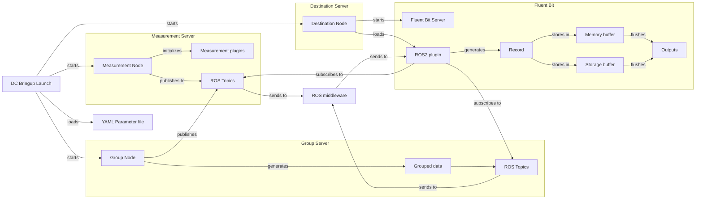

# Data Pipeline

The data flow precised in this flowchart summarizes how data moves:
1. DC Bringup loads the yaml configuration file
2. DC Bringup starts the measurement node
   1. Measurement plugins are loaded and data starts to be collected
   2. Each plugin publishes what it collected on a ROS topic
3. DC Bringup starts the destination node
   1. Destination plugins are loaded
   2. Fluent Bit server is started: as soon as it receives records, it goes through filters and then is flushed to desired destinations
   3. ROS2 Fluent Bit plugin is loaded: it subscribes to measurement and group output topics
   4. Fluent Bit filters are initialized: it edits data received, modify the tags to match the desired output(s) and edit the timestamp field if required
4. DC Bringup starts the group node
   1. Subscribes to measurement and group topics outputs
   2. When all measurements of a group are received, it publishes the grouped data on another group
