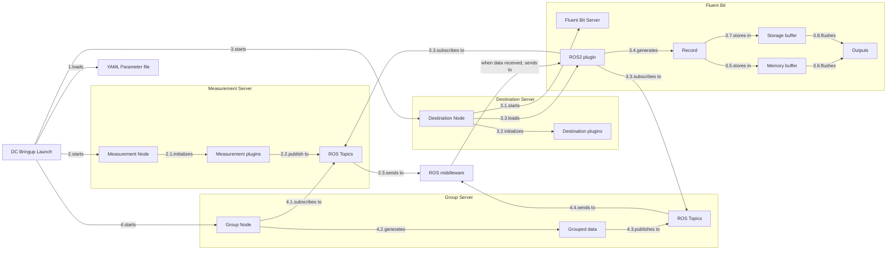

# Data Pipeline

## DC 2.0 (Jazzy): deterministic startup ordering

On the Jazzy line, `dc_bringup.launch.py` brings the pipeline up in a fixed order
(ADR-0006), so no Record can be emitted before the pipeline is able to accept it:

1. **Bridge first.** `dc_bridge` starts as a plain node (outside the lifecycle
   manager) and spawns the Vector shipper as a supervised child process. The
   measurement server also starts here, but stays unconfigured and inactive — its
   publishers cannot emit anything yet.
2. **Readiness gate.** A `bridge_ready_gate` process blocks polling the Bridge's
   `~/ready` service (`std_srvs/Trigger`), which answers `success=True` only once
   Vector is accepting Fluent Forward connections. The gate's `service`,
   `timeout_s` (default 120 s), and `poll_interval_s` parameters are configurable
   from the params file under `bridge_ready_gate:`.
3. **Activation.** Only when the gate exits successfully does the launch start
   `lifecycle_manager_dc`, which configures and then activates the collection
   nodes. If the Bridge never becomes ready before the gate's deadline, the whole
   launch shuts down loudly instead of leaving a half-started pipeline running.

Supervision after startup: the launch file respawns `dc_bridge` unconditionally
(independent of `use_respawn`), and the Bridge supervises its Vector child —
including a Linux parent-death signal, so Vector can never outlive the Bridge
even across a SIGKILL/crash. Records published while the Bridge is down are
dropped (topics are fire-and-forget); delivery resumes as soon as the respawned
Bridge is ready.

## Legacy (Humble): embedded Fluent Bit pipeline

```mermaid
flowchart LR
    dc_bringup_launch["DC Bringup Launch"]
    yaml_param["YAML Parameter file"]
    ros_middleware["ROS middleware"]

    subgraph m_s["Measurement Server"]
        direction LR
        meas_node["Measurement Node"]
        measurement_plugins["Measurement plugins"]
        meas_topics_out["ROS Topics"]
    end

    subgraph d_s["Destination Server"]
        direction LR
        dest_node["Destination Node"]
        dest_plugins["Destination plugins"]
    end

    subgraph g_s["Group Server"]
        direction LR
        group_node["Group Node"]
        group_grouped_data["Grouped data"]
        group_topics_out["ROS Topics"]
    end

    subgraph flb["Fluent Bit"]
        direction LR
        flb_server["Fluent Bit Server"]
        flb_mem_buff["Memory buffer"]
        flb_storage_buff["Storage buffer"]
        flb_record["Record"]
        flb_ros2_plugin["ROS2 plugin"]
        flb_output["Outputs"]
    end

    dc_bringup_launch--2.starts-->meas_node
    dc_bringup_launch--3.starts-->dest_node
    dc_bringup_launch--4.starts-->group_node
    dc_bringup_launch--1.loads-->yaml_param

    meas_node--2.1.initializes-->measurement_plugins
    measurement_plugins--"2.2.publish to"-->meas_topics_out

    dest_node--3.1.starts-->flb_server
    dest_node--3.2.initializes-->dest_plugins
    dest_node--3.3.loads-->flb_ros2_plugin

    flb_ros2_plugin--"3.3.subscribes to"-->meas_topics_out
    flb_ros2_plugin--"3.3.subscribes to"-->group_topics_out
    group_node--"4.1.subscribes to"-->meas_topics_out
    group_node--4.2.generates-->group_grouped_data
    group_grouped_data--"4.3.publishes to"-->group_topics_out

    flb_ros2_plugin--3.4.generates-->flb_record
    flb_record--"3.5.stores in"-->flb_mem_buff
    flb_record--"3.7.stores in"-->flb_storage_buff
    flb_mem_buff--3.6.flushes-->flb_output
    flb_storage_buff--3.8.flushes-->flb_output

    group_topics_out--"4.4.sends to"-->ros_middleware
    meas_topics_out--"2.3.sends to"-->ros_middleware
    ros_middleware--"when data received, sends to"-->flb_ros2_plugin
```

The data flow precised in this flowchart summarizes how data moves:
1. DC Bringup loads the yaml configuration file
2. DC Bringup starts the measurement node
   1. Measurement plugins are loaded and data starts to be collected
   2. Each plugin publishes what it collected on a ROS topic
3. DC Bringup starts the destination node
   1. Fluent Bit server is started: as soon as it receives records, it goes through filters and then is flushed to desired destinations
   2. Destination plugins are loaded
   3. ROS2 Fluent Bit plugin is loaded: it subscribes to measurement and group output topics
   4. Fluent Bit filters are initialized: it edits data received, modify the tags to match the desired output(s) and edit the timestamp field if required
4. DC Bringup starts the group node
   1. Subscribes to measurement and group topics outputs
   2. When all measurements of a group are received, it groups the JSONs into a new one
   3. It publishes the grouped data on another topic
