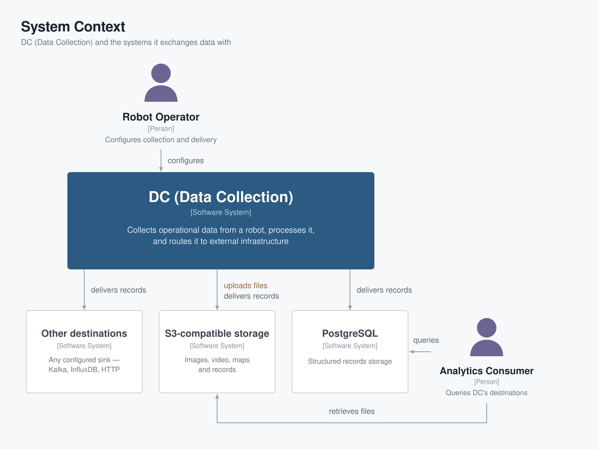
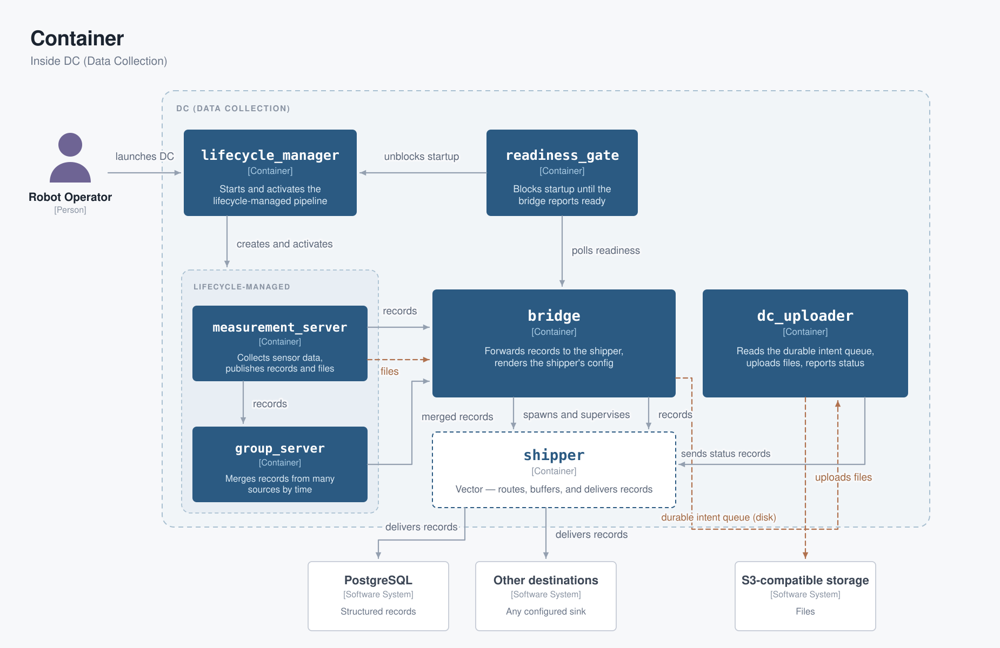
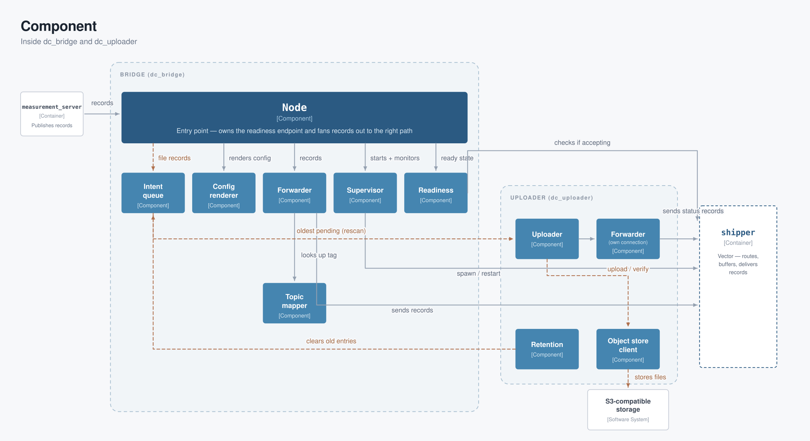
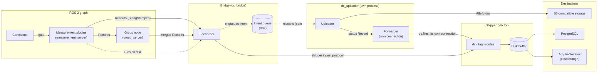

# Data Pipeline

This page follows one piece of data from the sensor that produced it to the external
system that stores it. The vocabulary — Measurement, Record, Group, File, Bridge,
Shipper, Destination, Tag — is defined in [Concepts](./concepts.md) and used
consistently throughout.

## C4 model

Three levels, each zooming further into the pipeline: DC as a single system among
external actors and destinations (Context), the processes that make it up (Container),
and the pieces inside the Bridge (Component). The flowchart in
[the next section](#the-path-of-a-record) stays as the at-a-glance narrative view of a
single Record's journey; these diagrams complement it rather than replace it.

### DC and the systems it exchanges data with (C1)

DC runs as one system on the robot. A robot operator configures it; analytics and
dashboard consumers read from whatever Destinations it was configured to write to —
PostgreSQL, S3-compatible object storage, and (via passthrough,
[ADR-0003](./adr/0003-blessed-destinations-plus-passthrough.md)) any other
Shipper-supported sink.

### Inside DC (C2)

Inside DC, `measurement_server` is the node lifecycle-managed by
`dc_lifecycle_manager` (see [Lifecycle Manager](./lifecycle_manager.md) for the
managed-node list and why it's just the one node today). `group_server` runs as a plain
node alongside it, not under lifecycle management. The Bridge (`dc_bridge`) and its
supervised Shipper child are deliberately outside that boundary too
([ADR-0006](./adr/0006-bridge-outside-lifecycle-manager.md)) — the
Bridge has no meaningful deactivated state, so its readiness comes from launch ordering
(`bridge_ready_gate`) instead of a lifecycle transition. See
[Deterministic startup ordering](#deterministic-startup-ordering) for the sequence this
diagram's `bridge_ready_gate` → `dc_lifecycle_manager` relationship summarizes.

**`dc_uploader`** is a fourth, independent process `dc_bringup.launch.py` starts
alongside the rest of the pipeline when a `receives: files` Destination is configured
([ADR-0014](./adr/0014-uploader-runs-as-its-own-process.md)) — it uploads Files and
reports their status directly to the Shipper over its own connection, so an Uploader
crash or restart never touches Record collection.

### Inside dc_bridge and dc_uploader (C3)

The pieces added across #244–#267, now invisible from the outside: `BridgeNode` wires a
Forwarder (Records → Shipper), a Supervisor (owns the Vector child process), a Config
renderer ([ADR-0003](./adr/0003-blessed-destinations-plus-passthrough.md)'s
`shipper`/`destinations` params → Vector TOML, including passthrough snippet
validation), Readiness (backs `~/ready`), and — for `receives: files` Destinations
([ADR-0005](./adr/0005-file-uploads-are-bridge-responsibility.md)) — a durable
on-disk IntentQueue it enqueues into and forgets.

That queue is where the Bridge's responsibility for a File ends. **`dc_uploader`**
([ADR-0014](./adr/0014-uploader-runs-as-its-own-process.md)) is a separate process —
its own executable, no `rclcpp`/`rclpy` dependency — that rescans the same on-disk
queue, uploads Files against an S3-compatible ObjectStore, and reports status Records
over its *own* Forwarder/Shipper connection under the `dc.files` Tag, entirely
independent of the Bridge's own Forwarder. Killing or restarting `dc_uploader` never
touches Record collection, since there is no shared address space left for it to take
down.

## The path of a Record

```mermaid
flowchart LR
    subgraph ros["ROS 2 graph"]
        meas["Measurement plugins<br/>(measurement_server)"]
        cond["Conditions"]
        group["Group node<br/>(group_server)"]
    end
    subgraph bridge["Bridge (dc_bridge)"]
        fwd["Forwarder"]
        iq[("Intent queue<br/>(disk)")]
    end
    subgraph uploader["dc_uploader (own process)"]
        upl["Uploader"]
        ufwd["Forwarder<br/>(own connection)"]
    end
    subgraph shipper["Shipper (Vector)"]
        route["dc.&lt;tag&gt; routes"]
        buf[("Disk buffer")]
    end
    subgraph dest["Destinations"]
        pg["PostgreSQL"]
        s3["S3-compatible storage"]
        other["Any Vector sink<br/>(passthrough)"]
    end

    cond -- gate --> meas
    meas -- "Records (StringStamped)" --> fwd
    meas -- "Records" --> group
    group -- "merged Records" --> fwd
    meas -. "Files on disk" .-> fwd
    fwd -. "enqueues intent" .-> iq
    iq -. "rescans (poll)" .-> upl
    fwd -- "shipper ingest protocol" --> route
    route --> buf
    buf --> pg
    buf --> other
    upl -- "File bytes" --> s3
    upl -- "status Record" --> ufwd
    ufwd -- "dc.files, its own connection" --> route
```

1. **A Measurement produces a Record.** Each Measurement plugin samples its source on a
   timer (or on an input topic) and publishes one timestamped JSON document as a
   `dc_interfaces/msg/StringStamped` on its `topic_output`. **Conditions** can gate
   whether the Measurement collects at all.
2. **Optionally, a Group merges Records.** The Group node subscribes to several
   Measurement topics and publishes one merged Record on `/dc/group/<name>` once their
   timestamps line up (`sync_delay`).
3. **The Bridge forwards every Record.** `dc_bridge` subscribes to every topic listed in
   any Destination's `inputs`, derives that topic's **Tag**, and hands the Record to the
   Shipper over the local shipper ingest socket (default `127.0.0.1:24224`), with
   receipt acknowledgement.
4. **The Shipper routes, buffers and delivers.** Vector normalizes the Record's
   timestamp field, exposes it on the public `dc.<tag>` route, writes it to a persistent
   disk buffer, and delivers it to each Destination wired to that route — retrying with
   its own backoff until it succeeds.
5. **Files take a different path.** A **File** (camera image, map, video) is never sent
   through the Shipper. `dc_bridge` parses the `local_paths`/`remote_paths` references
   embedded in the Record and durably enqueues an intent to a shared on-disk queue —
   then forgets it. **`dc_uploader`**, a separate process
   ([ADR-0014](./adr/0014-uploader-runs-as-its-own-process.md)), rescans that same
   queue, uploads the bytes to object storage, verifies them, and emits a *status
   Record* under the `dc.files` Tag over its own Shipper connection — which then
   travels the ordinary Record path. See
   [File uploads](./destinations.md#file-uploads-receives-files-the-uploader-adr-0005).

## Where each piece is configured

| Stage                          | Node               | Parameters                                     |
| ------------------------------ | ------------------ | ---------------------------------------------- |
| Producing Records              | `measurement_server` | [Measurements](./measurements.md)             |
| Gating collection              | `measurement_server` | [Conditions](./conditions.md)                 |
| Merging Records                | `group_server`     | [Groups](./groups.md)                          |
| Routing, buffering, delivering | `dc_bridge`        | [Destinations](./destinations.md)              |
| Uploading Files, reporting status | `dc_uploader`   | [File uploads](./destinations.md#file-uploads-receives-files-the-uploader-adr-0005) |

Routing is decided in exactly one place: a Destination's `inputs` list names the topics
it receives. Nothing on the producing side selects a Destination.

## Deterministic startup ordering

`dc_bringup.launch.py` brings the pipeline up in a fixed order
([ADR-0006](./adr/0006-bridge-outside-lifecycle-manager.md)), so no Record
can be emitted before the pipeline is able to accept it:

1. **Bridge first.** `dc_bridge` starts as a plain node (outside the lifecycle manager)
   and spawns the Vector Shipper as a supervised child process. `dc_uploader` starts
   alongside it at this same step, as its own process, unless the `run_uploader`
   launch argument is `False`
   ([ADR-0014](./adr/0014-uploader-runs-as-its-own-process.md)) — it isn't gated by
   readiness the way the collection nodes are, since it has nothing to wait for
   beyond the on-disk intent queue it rescans. The measurement server
   also starts here, but stays unconfigured and inactive — its publishers cannot emit
   anything yet.
2. **Readiness gate.** A `bridge_ready_gate` process blocks, polling the Bridge's
   `~/ready` service (`std_srvs/Trigger`), which answers `success=True` only once the
   Shipper is accepting connections on its ingest socket. The gate's `service`,
   `timeout_s` (default 120 s), and `poll_interval_s` parameters are configurable from
   the params file under `bridge_ready_gate:`.
3. **Activation.** Only when the gate exits successfully does the launch start
   `lifecycle_manager_dc`, which configures and then activates the collection nodes. If
   the Bridge never becomes ready before the gate's deadline, the whole launch shuts
   down loudly instead of leaving a half-started pipeline running.

See [Lifecycle Manager](./lifecycle_manager.md) for the diagrammed version of this
sequence, plus the state transitions and bond-heartbeat recovery behavior it drives
once activated.

## Durability and supervision

- **Disk buffering.** The Shipper owns a persistent disk buffer at `shipper.data_dir`.
  A Record the Bridge has handed over survives a Destination outage, a Bridge restart,
  and a robot reboot; delivery resumes — with end-to-end acknowledgements — once the
  Destination is reachable again.
- **Backpressure.** When a Destination is slow, the Shipper stops acknowledging, and the
  Bridge propagates that backwards rather than dropping data silently.
- **Supervision.** The launch file respawns `dc_bridge` unconditionally (independent of
  `use_respawn`), and the Bridge supervises its Shipper child — including a Linux
  parent-death signal, so the Shipper can never outlive the Bridge even across a
  SIGKILL or crash.
- **The one lossy window.** Records published while the Bridge is down are dropped: ROS
  topics are fire-and-forget and nothing buffers upstream of the Bridge. Delivery
  resumes as soon as the respawned Bridge is ready.
- **Delivery semantics.** At-least-once. After a crash or an induced outage, a boundary
  Record may be re-sent; deduplicate on read if that matters to you.
- **File uploads survive an Uploader crash.** An intent is only removed from the disk
  queue after a successful upload is acknowledged; killing `dc_uploader` mid-upload
  loses nothing; the next start replays the same intent from disk.
