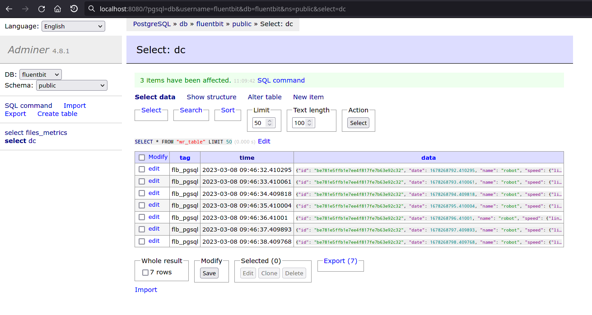
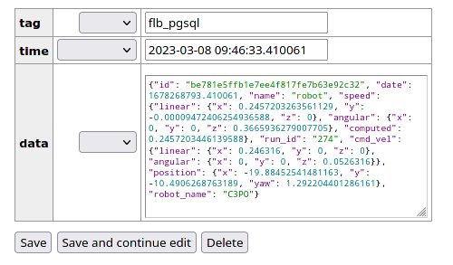
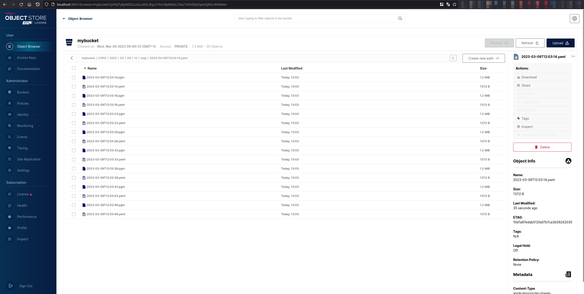
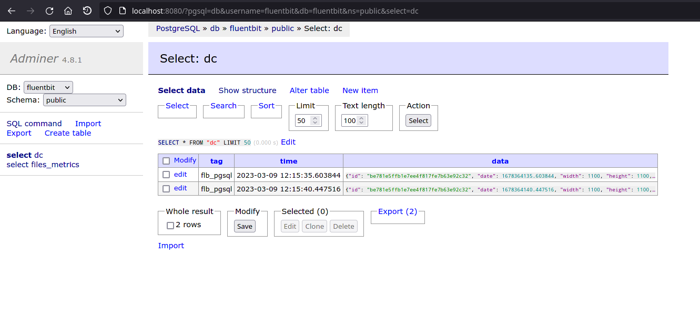
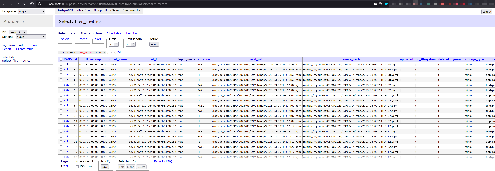

# QRCodes

In this example, we add a robot and start collecting robot data to PostgreSQL and maps and scanned QRcodes to MinIO as image files.

You will also need 2 terminal windows, to:

1. Run the Nav2 turtlebot3 launchfile: it starts localization, navigation and rviz
2. Run DC

Since rviz is pretty verbose, using 3 terminal windows will help reading the JSON printed on the terminal window.

| Terminal | Description                                     |
| -------- | ----------------------------------------------- |
| Rviz     | Start it independently because of its verbosity |
| Nav2     | Localization and navigation                     |
| DC       | Data collection                                 |

## Setup MinIO and PostgreSQL

### MinIO

MinIO will be used as storage for images and other files. To start it, [follow the steps](../infrastructure_setup/minio.md)

### PostgreSQL

PostgreSQL will be used as database storage for our JSON. Later on, backend engineers can make requests on those JSON based on measurement requested and time range. To start it, [follow the steps](../infrastructure_setup/postgresql.md)

## Setup the ROS environment

In each, terminal, source your environment and setup turtlebot configuration:

```bash
$ source /opt/ros/humble/setup.bash
$ source install/setup.bash
$ export GAZEBO_MODEL_PATH=$GAZEBO_MODEL_PATH:/opt/ros/humble/share/turtlebot3_gazebo/models
$ export GAZEBO_MODEL_PATH=$GAZEBO_MODEL_PATH:/opt/ros/humble/share/aws_robomaker_small_warehouse_world/models/
$ export TURTLEBOT3_MODEL=waffle
```

## Start RVIZ

```bash
$ ros2 run rviz2 rviz2 -d ${PWD}/install/dc_simulation/share/dc_simulation/rviz/qrcodes.rviz
```


## Start Navigation

Then, start the Turtlebot launchfile with custom parameters to start the QRcode world:

```bash
$ ros2 launch nav2_bringup tb3_simulation_launch.py \
    headless:=False \
    x_pose:="-16.679400" \
    y_pose:="-15.300200" \
    z_pose:="0.01" \
    roll:="0.00" \
    pitch:="0.00" \
    yaw:="1.570796" \
    robot_sdf:="${PWD}/install/dc_simulation/share/dc_simulation/worlds/waffle.model" \
    map:="${PWD}/install/dc_simulation/share/dc_simulation/maps/qrcodes.yaml" \
    world:="${PWD}/install/dc_simulation/share/dc_simulation/worlds/qrcodes.world" \
    nav2_params_file:="${PWD}/install/dc_simulation/share/dc_demos/params/qrcodes_nav.yaml" \
    dc_params_file:="${PWD}/install/dc_simulation/share/dc_demos/params/qrcodes_minio_pgsql.yaml" \
    use_rviz:=False
```

Rviz and Gazebo will start: you should now see the robot in Gazebo, and the map on Rviz.

Set the robot position using the "2D Pose Estimate" button.

## Start DC

Execute

```bash
$ ros2 launch dc_demos tb3_qrcodes_minio_pgsql.launch.py
```

With this, all data will be transmitted

## Understanding the configuration

The full configuration file can be found [here](https://github.com/Minipada/ros2_data_collection/blob/humble/dc_demos/params/qrcodes_minio_pgsql.yaml).

For this demo, we will reconstruct the yaml configuration element by element, given how large it is. Go through the explanation to understand how it works.

### Collect command velocity, position and speed to PostgreSQL

Similarly to the previous tutorial:

```yaml
destination_server:
  ros__parameters:
    flb:
      flush: 1
      flb_grace: 1
      log_level: "info"
      storage_path: "/var/log/flb-storage/"
      storage_sync: "full"
      storage_checksum: "off"
      storage_backlog_mem_limit: "1M"
      scheduler_cap: 200
      scheduler_base: 5
      http_server: true
      http_listen: "0.0.0.0"
      http_port: 2020
      in_storage_type: "filesystem"
      in_storage_pause_on_chunks_overlimit: "off"
    destination_plugins: ["flb_pgsql"]
    custom_str_params_list: ["robot_name", "id"]
    custom_str_params:
      robot_name:
        name: robot_name
        value: "C3PO"
      # Requires systemd package
      id:
        name: id
        value_from_file: /etc/machine-id
    run_id:
      enabled: true
      counter: true
      counter_path: "$HOME/run_id"
      uuid: false
    flb_pgsql:
      plugin: "dc_destinations/FlbPgSQL"
      inputs: ["/dc/group/robot"]
      host: "127.0.0.1"
      port: 5432
      user: fluentbit
      password: password
      database: "fluentbit"
      table: "dc"
      timestamp_key: "date"
      async: false
      time_format: "double"
      time_key: "date"

group_server:
  ros__parameters:
    groups: ["robot"]
    robot:
      inputs:
        [
          "/dc/measurement/cmd_vel",
          "/dc/measurement/position",
          "/dc/measurement/speed",
        ]
      output: "/dc/group/robot"
      sync_delay: 5.0
      group_key: "robot"
      tags: ["flb_pgsql"]

measurement_server:
  ros__parameters:
    custom_str_params: ["robot_name"]
    robot_name: "C3PO"
    measurement_plugins: ["cmd_vel", "position", "speed"]
    moving:
      plugin: "dc_conditions/Moving"
    cmd_vel:
      plugin: "dc_measurements/CmdVel"
      group_key: "cmd_vel"
      enable_validator: true
      topic_output: "/dc/measurement/cmd_vel"
      include_measurement_name: true
    position:
      plugin: "dc_measurements/Position"
      group_key: "position"
      topic_output: "/dc/measurement/position"
      enable_validator: true
      global_frame: "map"
      robot_base_frame: "base_link"
      transform_timeout: 0.1
      include_measurement_name: true
    speed:
      plugin: "dc_measurements/Speed"
      group_key: "speed"
      odom_topic: "/odom"
      topic_output: "/dc/measurement/speed"
      include_measurement_name: true
```

In the measurement server, we set 3 measurements: cmd_vel, position and speed being collected once per second, are validated with their respective JSON schemas and publish on their own topics.

Note the `include_measurement_name` which include measurement name in the JSON, which is used when grouping. The group collects the data from those 3 measurement and republishes it on the group topic `/dc/group/robot`.

In the destination server, we enable the PostgreSQL plugin and configure its credentials.

```admonish warning

Be sure to change the login and password to your current infrastructure configuration. Do it in production setup!
```

You can find more about the PostgreSQL plugin [here](../destinations/flb_files_metrics.md)

To take a look at records, go to Adminer. It is by default started at [http://localhost:8080](http://localhost:8080), it is a database GUI.:



You can then click on a record, to take a look, edit or delete it:



### Collect the map image and YAML from nav2_map_server to MinIO

First, we add the map measurement. We use 3 plugins here: flb_pgsql to send the data to PostgreSQL on the dc database, then flb_minio to send some files to MinIO and flb_files_metrics which will be used to autodelete the files once they reach their destination.

```yaml
measurement_server:
  ros__parameters:
  ...
  measurement_plugins: ["map"]
  map:
    plugin: "dc_measurements/Map"
    group_key: "map"
    polling_interval: 5000
    save_path: "map/%Y-%m-%dT%H:%M:%S"
    topic_output: "/dc/measurement/map"
    save_map_timeout: 4.0
    remote_prefixes: [""]
    remote_keys: ["minio"]
    enable_validator: true
    tags: ["flb_pgsql", "flb_minio", "flb_files_metrics"]
    include_measurement_name: true
  ...
```

Then we add the destinations:

```yaml
destination_server:
  ros__parameters:
    ...
    destination_plugins: ["flb_files_metrics", "flb_pgsql", "flb_minio"]
    flb_files_metrics:
      plugin: "dc_destinations/FlbFilesMetrics"
      inputs: ["/dc/measurement/map"]
      file_storage: ["minio"]
      db_type: "pgsql"
      delete_when_sent: true
      minio:
        endpoint: 127.0.0.1:9000
        access_key_id: rQXPf1f730Yuu2yW
        secret_access_key: TYYkjN5L4gqDgCGLzQahHDcvqL4WNTcb
        use_ssl: false
        bucket: "mybucket"
        src_fields: ["local_paths.pgm", "local_paths.yaml"]
        upload_fields: ["remote_paths.minio.pgm", "remote_paths.minio.yaml"]
        input_names: ["map", "map"]
      pgsql:
        host: "127.0.0.1"
        port: "5432"
        user: fluentbit
        password: password
        database: "fluentbit"
        table: "files_metrics"
        timestamp_key: "date"
        time_format: "double"
        time_key: "date"
        ssl: false
    flb_minio:
      verbose_plugin: false
      time_format: "iso8601"
      plugin: "dc_destinations/FlbMinIO"
      inputs: ["/dc/measurement/map"]
      endpoint: 127.0.0.1:9000
      access_key_id: rQXPf1f730Yuu2yW
      secret_access_key: TYYkjN5L4gqDgCGLzQahHDcvqL4WNTcb
      use_ssl: false
      create_bucket: true
      bucket: "mybucket"
      src_fields: ["local_paths.pgm", "local_paths.yaml"]
      upload_fields: ["remote_paths.minio.pgm", "remote_paths.minio.yaml"]
    flb_pgsql:
      plugin: "dc_destinations/FlbPgSQL"
      inputs: ["/dc/group/map"]
      host: "127.0.0.1"
      port: 5432
      user: fluentbit
      password: password
      database: "fluentbit"
      table: "dc"
      timestamp_key: "date"
      async: false
      time_format: "double"
      time_key: "date"
```

This will save the map pgm and yaml every 5 seconds to MinIO. Head to the MinIO GUI, which is by default located at [http://localhost:9001](http://localhost:9001). Default user/password are **minioadmin**/**minioadmin**.



It will also save the map metadata on PostgreSQL, which you can later use to know the map location on MinIO and its dimensions for example:



We also transmit the metadata, to be fetched later on by the backend (map dimension). It is set in the flb_pgsql measurement plugin.

The flb_metrics plugin is also enabled. We use it to track if the file is on the filesystem and also delete it once it reaches its destination, here MinIO. This plugins deletes file when they are sent with the `delete_when_sent` parameter. More about the plugin [here](../destinations/flb_files_metrics.md)

Then, similarly, on Adminer, you can check the data is uploaded:


