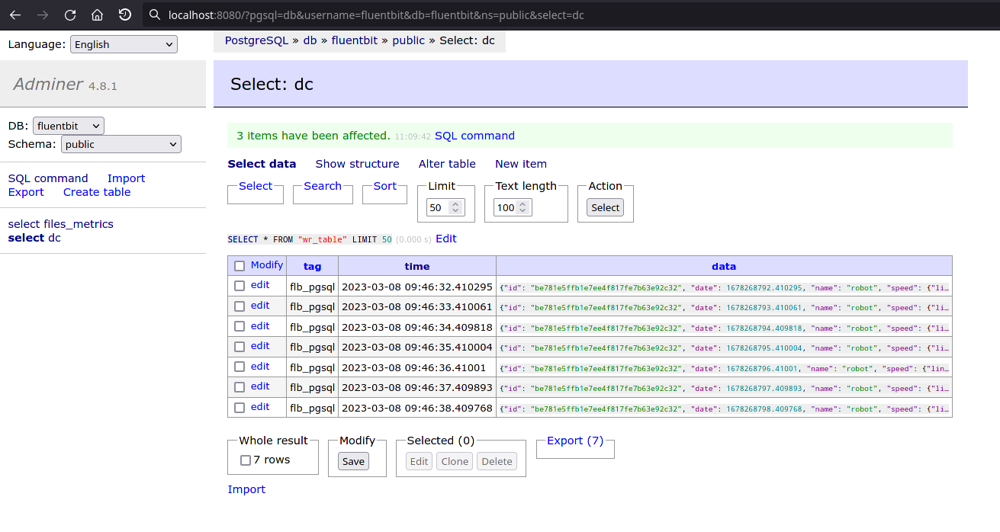
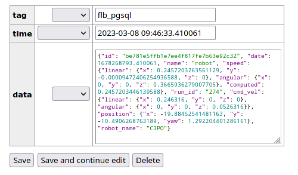

# QRCodes

In this example, we add a robot and start collecting robot data to PostgreSQL, and maps and scanned QR codes to RustFS as image files.

You will also need 3 terminal windows, to:

1. Run the simulation + Nav2 launchfile: it starts gz-sim, localization, navigation and RViz
2. Run DC
3. Drive the robot past the QR codes

Keeping them separate helps reading the JSON printed on the DC terminal, which
RViz and gz-sim would otherwise drown out.

| Terminal | Description                                        |
| -------- | -------------------------------------------------- |
| Nav2     | gz-sim, localization, navigation and RViz          |
| DC       | Data collection                                     |
| Run      | Waypoint follower driving past every QR-coded pallet |

## Setup RustFS and PostgreSQL

### RustFS

RustFS will be used as storage for the map and camera image Files. To start it, [follow the steps](../infrastructure_setup/rustfs.md) — a single RustFS container plus a one-shot container that bootstraps the `dc-files` bucket the Destinations below upload into, using the default `rustfsadmin`/`rustfsadmin` credentials this demo's params file already assumes.

### PostgreSQL

PostgreSQL will be used as database storage for our JSON. Later on, backend engineers can make requests on those JSON based on measurement requested and time range. To start it, [follow the steps](../infrastructure_setup/postgresql.md)

```admonish info
Vector's `postgres` sink maps each top-level key of a Record's JSON payload onto an existing column of the same name — it does not create tables or columns itself. `tools/infrastructure/docker/config/postgresql/init.sql` pre-creates the `dc` and `dc_files` tables this demo writes into; see its header comment for the full column reference if you add a measurement whose fields aren't already columns.
```

## Setup the ROS environment

In each terminal, source your environment:

```bash
source /opt/ros/jazzy/setup.bash
source install/setup.bash
```

Nothing else has to be exported. `dc_simulation`'s environment hook puts its own
`models/` and `worlds/` on `GZ_SIM_RESOURCE_PATH`, and `warehouse.launch.py` adds
`nav2_minimal_tb3_sim`'s models (where the TurtleBot3 meshes live now — the
Gazebo Classic `turtlebot3_gazebo` package has no Jazzy release).

## Start Navigation

`dc_demos`' own launch file brings up gz-sim with the QR-code warehouse world,
spawns `dc_simulation`'s TurtleBot3-Waffle with its `ros_gz_bridge`, and starts
Nav2 (`map_server` + AMCL + planners) against `dc_simulation/maps/qrcodes.yaml`.
It also starts DC, which this demo drives separately, so turn that off here:

```bash
ros2 launch dc_demos tb3_qrcodes.launch.py \
    headless:=False \
    use_dc:=False
```

gz-sim and RViz will start: you should see the robot in the warehouse, and the
map in RViz. AMCL sets the demo's initial pose itself (`set_initial_pose` in
`qrcodes_nav.yaml`), so there is no need to click "2D Pose Estimate" — wait until
the laser scan lines up with the map before starting the run below.

```admonish warning
The warehouse world is heavy: 238 model instances, most of them the QR-coded
pallets and the props stacked on them. Expect a slow start on a machine without a GPU:
gz-sim, the robot and Nav2 come up in well under a minute, but with the real-time factor
well under 1 (~0.11-0.2, see [dc_simulation's README](https://github.com/Minipada/ros2_data_collection/blob/jazzy/dc_simulation/README.md)
for the measured breakdown), reaching the first QR-coded pallet and getting the first
Record out of the demo can take several minutes of wall clock, and the full 60-waypoint
pass over an hour. See [#52](https://github.com/Minipada/ros2_data_collection/issues/52).
```

## Start DC

Execute

```bash
ros2 launch dc_demos tb3_qrcodes_minio_pgsql.launch.py
```

With this, all data will be transmitted

## Drive the robot past the QR codes

In a fourth terminal, run the waypoint follower. It sends the robot down each
aisle, stopping in front of every QR-coded pallet so both cameras can read them,
and exits once the pass is complete:

```bash
ros2 run dc_demos qrcodes_waypoint_follower
```

```admonish info
The waypoints are camera stations, not just places to be, and the aisles are narrow
enough that the difference matters: a code is only readable while

    |lateral error| + standoff * tan(|yaw error|) + 0.181 <= standoff * tan(30°)

where 0.181 m is half a rendered QR symbol and 30° is half the cameras' field of view.
The tightest station has a 0.73 m standoff, which is why `qrcodes_nav.yaml` stops the
robot within 0.1 m and 0.1 rad rather than Nav2's more usual tolerances. If you move the
waypoints, the pallets or the cameras, re-run `./tools/sim/scripts/run.sh` — its `lint`
stage re-derives that inequality from the world, the robot model, the waypoints and the
nav params, and its `detect` stage checks that codes really do come back. See
[dc_simulation's README](https://github.com/Minipada/ros2_data_collection/blob/jazzy/dc_simulation/README.md)
for the measured geometry.
```

## Understanding the configuration

```admonish info
The full configuration file can be found [here](https://github.com/Minipada/ros2_data_collection/blob/jazzy/dc_demos/params/qrcodes_minio_pgsql.yaml).
```

For this demo, we will reconstruct the yaml configuration element by element, given how large it is. Go through the explanation to understand how it works.

### Collect command velocity, position and speed to PostgreSQL as a group

Similarly to the previous tutorial:

```yaml
dc_bridge:
  ros__parameters:
    shipper:
      data_dir: "$HOME/.dc/buffer"
    destinations: ["pgsql", "pgsql_files", "rustfs"]
    pgsql:
      type: postgres
      receives: records
      inputs:
        [
          "/dc/measurement/map",
          "/dc/measurement/right_camera",
          "/dc/measurement/left_camera",
          "/dc/group/robot",
        ]
      host: "127.0.0.1"
      port: 5432
      user: "dc"
      password: "password"
      database: "dc"
      table: "dc"
      time_key: "date"
      time_format: "double"

group_server:
  ros__parameters:
    groups: ["robot"]
    robot:
      inputs:
        [
          "/dc/measurement/cmd_vel",
          "/dc/measurement/position",
          "/dc/measurement/speed",
        ]
      output: "/dc/group/robot"
      sync_delay: 5.0
      group_key: "robot"

measurement_server:
  ros__parameters:
    custom_keys_str: ["robot_name"]
    robot_name: "C3PO"
    measurement_plugins: ["cmd_vel", "position", "speed"]
    custom_key_str_list: ["robot_name", "id"]
    custom_keys_str:
      robot_name:
        name: robot_name
        value: "C3PO"
      # Requires systemd package
      id:
        name: id
        value_from_file: /etc/machine-id
    run_id:
      enabled: true
      counter: true
      counter_path: "$HOME/run_id"
      uuid: false
    moving:
      plugin: "dc_conditions/Moving"
    cmd_vel:
      plugin: "dc_measurements/CmdVel"
      group_key: "cmd_vel"
      enable_validator: true
      topic_output: "/dc/measurement/cmd_vel"
      include_measurement_name: true
    position:
      plugin: "dc_measurements/Position"
      group_key: "position"
      topic_output: "/dc/measurement/position"
      enable_validator: true
      global_frame: "map"
      robot_base_frame: "base_link"
      transform_timeout: 0.1
      include_measurement_name: true
    speed:
      plugin: "dc_measurements/Speed"
      group_key: "speed"
      odom_topic: "/odom"
      topic_output: "/dc/measurement/speed"
      include_measurement_name: true
```

In the measurement server, we set 3 measurements: cmd_vel, position and speed being collected once per second, are validated with their respective JSON schemas and publish on their own topics.

Note the `include_measurement_name` which include measurement name in the JSON, which is used when grouping. The group collects the data from those 3 measurement and republishes it on the group topic `/dc/group/robot`.

`dc_bridge` owns every Destination this demo uses. `pgsql` is a `postgres` Destination — its `inputs` list already names every topic this demo produces (`/dc/group/robot` for this section, plus `/dc/measurement/map`, `/dc/measurement/right_camera` and `/dc/measurement/left_camera` for the sections below): unlike the retired per-measurement `tags: [...]` mechanism, a Destination's `inputs` is the single place that decides what reaches it, so we declare it once and simply grow the measurements that feed those topics as we go.

```admonish warning

Be sure to change the login and password to your current infrastructure configuration. Do it in production setup!
```

You can find more about the `postgres` Destination type [here](../destinations.md)

To take a look at records, go to Adminer. It is by default started at [http://localhost:8080](http://localhost:8080), it is a database GUI.:



You can then click on a record, to take a look, edit or delete it:



### Send the map image and YAML from nav2_map_server to RustFS

First, we add the map measurement. Its `remote_keys` names the `rustfs` Destination, which is what actually uploads the pgm/yaml Files — the map measurement only records where they are, locally and (once uploaded) remotely:

```yaml
measurement_server:
  ros__parameters:
  ...
  measurement_plugins: ["map"]
  map:
    plugin: "dc_measurements/Map"
    group_key: "map"
    polling_interval: 5000
    save_path: "map/%Y-%m-%dT%H:%M:%S"
    topic_output: "/dc/measurement/map"
    save_map_timeout: 4.0
    remote_prefixes: [""]
    remote_keys: ["rustfs"]
    enable_validator: true
    include_measurement_name: true
  ...
```

Then, the Destinations that make this work:

```yaml
dc_bridge:
  ros__parameters:
    ...
    destinations: ["pgsql", "pgsql_files", "rustfs"]
    pgsql_files:
      type: postgres
      receives: records
      host: "127.0.0.1"
      port: 5432
      user: "dc"
      password: "password"
      database: "dc"
      table: "dc_files"
      time_key: "date"
      time_format: "double"
    rustfs:
      type: s3
      receives: files
      inputs:
        [
          "/dc/measurement/map",
          "/dc/measurement/right_camera",
          "/dc/measurement/left_camera",
        ]
      bucket: "dc-files"
      endpoint: "http://127.0.0.1:9000"
      region: "us-east-1"
      access_key_id: "rustfsadmin"
      secret_access_key: "rustfsadmin"
      force_path_style: true
    files:
      delete_when_sent: true
      metadata_destination: "pgsql_files"
```

This introduces the two-way PostgreSQL split this demo relies on:

- **`pgsql`** (already declared above) is a plain `receives: records` Destination — it carries the map's own metadata Record (dimensions, resolution, local/remote paths) like any other measurement.
- **`pgsql_files`** is a *second* `postgres` Destination, dedicated to the Uploader's own bookkeeping. It has no `inputs` of its own — it is never subscribed to directly, and is fed internally whenever `files.metadata_destination` names it, which is how every `receives: files` Destination in this file (here, `rustfs`) reports upload status.
- **`rustfs`** is the `s3` Destination that actually uploads the pgm/yaml bytes. `receives: files` marks it as owned by the Bridge's **Uploader** (ADR-0005) rather than a Vector sink: the Uploader scans Records arriving on `rustfs`'s `inputs` for `remote_paths` entries whose key matches a Destination name — here `rustfs`, matching the map measurement's `remote_keys` above — uploads the referenced Files, verifies they landed, and emits a status Record under `dc.files`, routed to whatever `pgsql_files` names.

See [Destinations](../destinations.md) for the full `files:`/Uploader contract, and [ADR-0005](https://github.com/Minipada/ros2_data_collection/blob/jazzy/docs/adr/0005-file-uploads-are-bridge-responsibility.md) for why file uploads are a Bridge responsibility rather than a Vector sink.

`files.delete_when_sent: true` means the local pgm/yaml are removed only once RustFS confirms the upload — never before.

You can check upload status and completion in Grafana's **Robot** dashboard, whose "Uploaded inspection files" and "Group completion status" panels query the `dc_files` table `pgsql_files` writes into:

```sql
SELECT to_timestamp(updated_at) AS "time", group_name, robot_name, storage_type, remote_path, content_type, size, uploaded
FROM dc_files WHERE kind = 'file_status' ORDER BY updated_at DESC LIMIT 100
```

Then, similarly, on Adminer, you can browse the `dc` table's map rows.

### Send QR code images to RustFS

We want to collect pictures taken by the cameras

```yaml
measurement_server:
  ros__parameters:
  ...
  measurement_plugins: ["cmd_vel", "position", "speed", "map", "right_camera", "left_camera"]
  condition_plugins: ["moving", "inspected_exists"]
  custom_key_str_list: ["robot_name", "id"]
  custom_keys_str:
    robot_name:
      name: robot_name
      value: "C3PO"
    # Requires systemd package
    id:
      name: id
      value_from_file: /etc/machine-id
  run_id:
    enabled: true
    counter: true
    counter_path: "$HOME/run_id"
    uuid: false
  moving:
    plugin: "dc_conditions/Moving"
  inspected_exists:
    plugin: "dc_conditions/Exist"
    key: "inspected"
  right_camera:
    plugin: "dc_measurements/Camera"
    group_key: "right_camera"
    if_none_conditions: ["moving"]
    if_all_conditions: ["inspected_exists"]
    topic_output: "/dc/measurement/right_camera"
    init_collect: false
    init_max_measurements: -1
    condition_max_measurements: 1
    node_name: "dc_measurement_camera"
    cam_topic: "/right_intel_realsense_r200_depth/image_raw"
    cam_name: right_camera
    enable_validator: true
    draw_det_barcodes: true
    save_raw_img: false
    save_rotated_img: false
    save_detections_img: true
    save_inspected_path: "right_camera/inspected/%Y-%m-%dT%H-%M-%S"
    rotation_angle: 0
    detection_modules: ["barcode"]
    remote_prefixes: [""]
    remote_keys: ["rustfs"]
    include_measurement_name: true
  left_camera:
    plugin: "dc_measurements/Camera"
    group_key: "left_camera"
    if_none_conditions: ["moving"]
    if_all_conditions: ["inspected_exists"]
    topic_output: "/dc/measurement/left_camera"
    init_collect: true
    init_max_measurements: -1
    condition_max_measurements: 1
    node_name: "dc_measurement_camera"
    cam_topic: "/left_intel_realsense_r200_depth/image_raw"
    cam_name: left_camera
    enable_validator: true
    draw_det_barcodes: true
    save_raw_img: false
    save_rotated_img: false
    save_detections_img: true
    save_inspected_path: "left_camera/inspected/%Y-%m-%dT%H-%M-%S"
    rotation_angle: 0
    detection_modules: ["barcode"]
    remote_prefixes: [""]
    remote_keys: ["rustfs"]
    include_measurement_name: true
  ...
```

Taking a look at the cameras, we can understand that:
1. Data is only collected when the robot is not moving: `if_none_conditions: ["moving"]`
2. Data is only collected when there is inspected data, so only when a QR code is detected: `if_all_conditions: ["inspected_exists"]`
3. Data is not collected constantly: `init_max_measurements: -1`
4. Only one record is collected when conditions are triggered: `condition_max_measurements: 1`
5. Only images with inspected data are collected:
   1. `save_raw_img: false`
   2. `save_rotated_img: false`
   3. `save_detections_img: true`
6. Barcodes are scanned in each image: `detection_modules: ["barcode"]`

`include_measurement_name` matters here too: the Uploader relies on it to know which top-level field of the Record holds the `local_paths`/`remote_paths` it should act on.

No new Destination block is needed for the cameras: `pgsql` and `rustfs` already list `/dc/measurement/right_camera` and `/dc/measurement/left_camera` in their `inputs` (see the first section above) — a Destination's `inputs` is a single, global list of topics rather than something declared per measurement, so adding a measurement that feeds an already-configured Destination requires no `dc_bridge` change at all.

Here, we collect images with the `rustfs` Destination, and their metadata (which record they belong to, remote path once uploaded, image dimensions where relevant) through `pgsql`. `pgsql_files`, fed by the Uploader, tracks when each image is sent to RustFS and — with `files.delete_when_sent: true` — is deleted locally once confirmed. Note that a Record's `remote_paths` can name several Destinations at once; the Uploader sends to every one whose name appears there.

An example Record for `right_camera`, once the image is inspected:

```json
{
  "camera_name": "right_camera",
  "date": 1677668926.700422,
  "id": "be781e5ffb1e7ee4f817fe7b63e92c32",
  "robot_name": "C3PO",
  "run_id": "218",
  "local_img_paths": {
    "inspected": "/root/dc_data/C3PO/2023/03/01/17/right_camera/inspected/2023-03-01T17-12-57.jpg"
  },
  "remote_paths": {
    "rustfs": {
      "inspected": "C3PO/2023/03/01/17/right_camera/inspected/2023-03-01T17-12-57.jpg"
    }
  },
  "inspected": {
    "barcode": [
      {
        "data": [81, 82, 99, 111, 100, 101, 45, 49],
        "height": 40,
        "width": 40,
        "top": 120,
        "left": 200,
        "type": "QRCODE"
      }
    ]
  }
}
```
