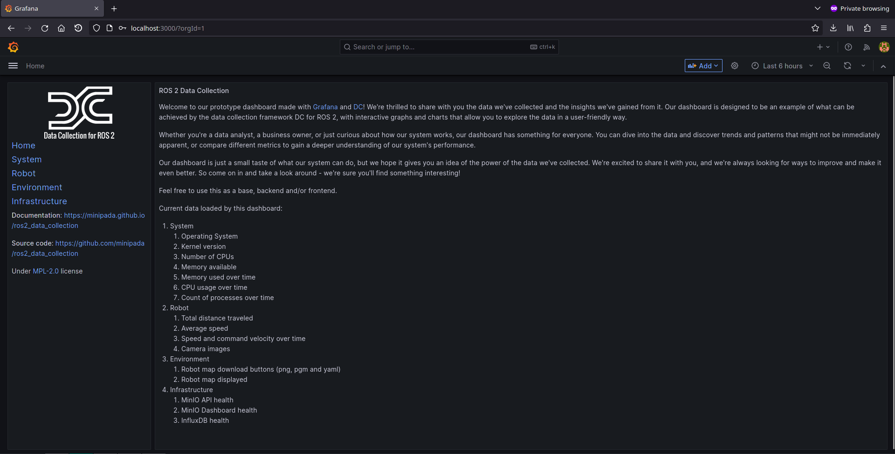

# Turtlebot3

In this example, we add a robot and start collecting robot data to Stdout.

You will also need 3 terminal windows, to:

1. Run the Nav2 turtlebot3 launchfile: it starts localization, navigation and RViz
2. Run navigation inspection demo
3. Run DC

Using a different terminal window for DC helps reading its information.

## Packages in the workspace

In addition to the ros2_data_collection repo in your workspace, you will need to download the [aws warehouse package](https://github.com/aws-robotics/aws-robomaker-small-warehouse-world/tree/ros2):

```bash
cd src
git clone https://github.com/aws-robotics/aws-robomaker-small-warehouse-world.git -b ros2
cd ..
colcon build
```

## Setup the environment
### Python dependencies

For this tutorial, we will need to install all dependencies:

```bash
pip3 install -r requirements.txt -r requirements-dev.txt
```

### Setup the infrastructure
#### InfluxDB
[InfluxDB](https://www.influxdata.com/) will be used to store our data and timestamps. Later on, backend engineers can make requests on those JSON based on measurement requested and time range. To start it, [follow the steps](../infrastructure_setup/influxdb.md)

#### Grafana
[Grafana](https://grafana.com/) will be used to display the data as timeseries or statistics.

### Setup simulation environment
In the terminal 1, source your environment, setup turtlebot configuration:

```bash
source /opt/ros/humble/setup.bash
source install/setup.bash
export GAZEBO_MODEL_PATH=$GAZEBO_MODEL_PATH:/opt/ros/humble/share/turtlebot3_gazebo/models
export GAZEBO_RESOURCE_PATH=${PWD}/src/aws-robomaker-small-warehouse-world/
export TURTLEBOT3_MODEL=waffle
source /usr/share/gazebo/setup.bash
```

Verify the gazebo world can be loaded properly:

```bash
gazebo /opt/ros/humble/share/aws_robomaker_small_warehouse_world/worlds/no_roof_small_warehouse/no_roof_small_warehouse.world
```

Gazebo will start with the warehouse environment. You can close it now.

```admonish info

I believe requiring the source along with those export are needed because of [this issue](https://github.com/aws-robotics/aws-robomaker-small-warehouse-world/issues/22)
```

## Terminal 1: Start Navigation

Then, in the same terminal (1), start the Turtlebot launchfile:

```bash
ros2 launch nav2_bringup tb3_simulation_launch.py \
    world:=/opt/ros/humble/share/aws_robomaker_small_warehouse_world/worlds/no_roof_small_warehouse/no_roof_small_warehouse.world \
    map:=/opt/ros/humble/share/aws_robomaker_small_warehouse_world/maps/005/map.yaml \
    headless:=False \
    x_pose:=3.45 \
    y_pose:=2.15 \
    yaw:=3.14
```

RViz and Gazebo will start: now you see the robot in Gazebo, and the map on RViz.


## Terminal 2: Start DC
Run colcon build to compile the workspace:

```bash
colcon build
```

Now, start the demo:

```bash
ros2 launch dc_demos tb3_simulation_influxdb.launch.py
```

The robot will start collecting data.

## Terminal 3: Start autonomous navigation

Execute

```bash
ros2 run nav2_simple_commander demo_security
```

The robot will start moving and you will be able to see all visualizations activated in RViz:


## Visualize the data

### With Grafana Dashboard
Open your browser at [http://localhost:3000](http://localhost:3000) and login with admin/admin



<video src="../../images/demos-tb3_aws_minio_pgsql-streamlit.webm" controls="controls"></video>

## Understanding the configuration
```admonish info
The full configuration file can be found [here](https://github.com/Minipada/ros2_data_collection/blob/humble/dc_demos/params/tb3_simulation_influxdb.yaml).
```

### Measurement server
#### Measurements
`measurement_plugins` sets which plugin to load. We collect

System measurements:

1. [CPU](../measurements/cpu.md)
2. [OS](../measurements/os.md)
3. [Memory](../measurements/memory.md)
4. [Uptime](../measurements/uptime.md)

Robot measurements:

1. [Camera images](../measurements/camera.md)
2. [Command velocities](../measurements/cmd_vel.md)
3. [Distance traveled](../measurements/distance_traveled.md)
4. [Positions](../measurements/position.md)
5. [Speed](../measurements/speed.md)

Environment measurements:

1. [Map](../measurements/map.md)

Infrastructure measurements:

1. [InfluxDB health](../measurements/tcp_health.md)

Each has their own configuration: polling interval, source topic, destination paths, topics used as input etc. Going through each of them would be too long here but you can check for each measurement its documentation and the general [documentation of measurements](../measurements.md)

Note that all measurements have the `nested` and `flattened` parameter set to True, this will transform each measurement to conform to how InfluxDB stores data. See nested and flattened in the measurements page.

Note also that all images (map and camera images) are stored as base64 strings because Grafana, the frontend at the end will only be able to access strings from the database.

#### Conditions
We also initialize conditions:

1. min_distance_traveled
2. max_distance_traveled

They are used in the distance traveled measurement to only take values in a certain range.

### Destination server

Here we only enable the InfluxDB plugins since it is where we send the data.

At the end, we want to display the data on Grafana. Grafana can only display content stored on the connected database. This also includes images, which is why they are stored as base64 strings.

#### InfluxDB destination
We pass all topics generated by measurements. The node will subscribe to it and transfer the data to InfluxDB.

Along with the inputs, we pass the server credentials.
