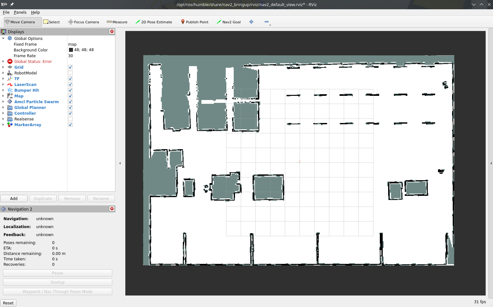
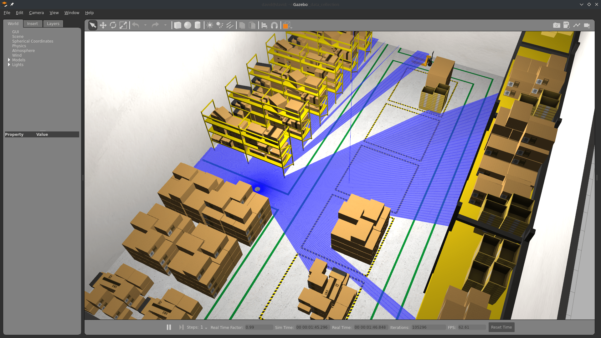
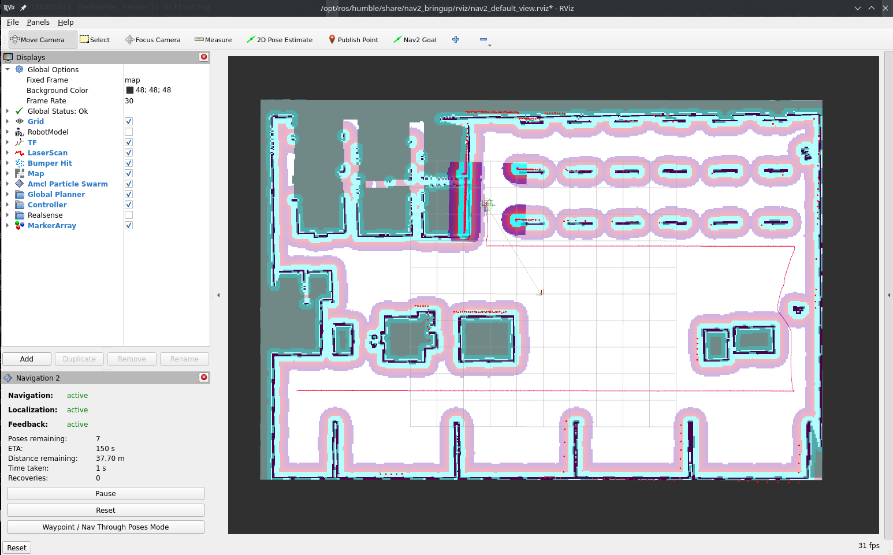

# Turtlebot3 AWS Warehouse InfluxDB

`dc_bridge` blesses exactly four Destination types — `postgres`, `s3`, `file`, `console`
(see [Destinations](../destinations.md)) — and InfluxDB is not one of them. This demo is
not a peer of the [PostgreSQL/RustFS demos](./tb3_aws_minio_pgsql.md): it exists to show
how to reach a destination `dc_bridge` doesn't bless directly, via the ADR-0003
**passthrough** escape hatch — a raw [Vector](https://vector.dev) sink config loaded
through `custom_config_files`, consuming the same public `dc.<tag>` routes a blessed
Destination would. Read [Destinations](../destinations.md)'s "Passthrough" section first
if you haven't already; this page only covers what's specific to InfluxDB.

You will also need 3 terminal windows, to:

1. Run the Nav2 turtlebot3 launchfile: it starts localization, navigation and RViz
2. Run navigation inspection demo
3. Run DC

Using a different terminal window for DC helps reading its information.

## Packages in the workspace

In addition to the ros2_data_collection repo in your workspace, you will need to download the [aws warehouse package](https://github.com/aws-robotics/aws-robomaker-small-warehouse-world/tree/ros2):

```bash
cd src
git clone https://github.com/aws-robotics/aws-robomaker-small-warehouse-world.git -b ros2
cd ..
colcon build
```

## Setup the environment

### Python dependencies

For this tutorial, we will need to install all dependencies:

```bash
pip3 install -r requirements.txt -r requirements-dev.txt
```

### Setup the infrastructure

#### InfluxDB

[InfluxDB](https://www.influxdata.com/) will be used to store our data and timestamps. To start it, [follow the steps](../infrastructure_setup/influxdb.md) (`tools/infrastructure/docker/docker-compose.influxdb.yaml`, unchanged by the DC 2.0 rework — this demo still needs a real InfluxDB instance to point the passthrough sink at).

#### One-time: install the passthrough sink config

`dc_bridge` has no InfluxDB Destination to configure through ROS parameters, so the
Vector sink itself ships as a plain file in this package,
`dc_demos/config/tb3_simulation_influxdb_sink.toml`, installed to the package's share
directory. Copy it into place once before the first launch:

```bash
mkdir -p ~/.dc
cp "$(ros2 pkg prefix dc_demos)/share/dc_demos/config/tb3_simulation_influxdb_sink.toml" ~/.dc/
```

`dc_params_file`'s `custom_config_files` (see below) points at this path.

### Setup simulation environment
In the terminal 1, source your environment, setup turtlebot configuration:

```bash
source /opt/ros/humble/setup.bash
source install/setup.bash
export GAZEBO_MODEL_PATH=$GAZEBO_MODEL_PATH:/opt/ros/humble/share/turtlebot3_gazebo/models
export GAZEBO_RESOURCE_PATH=${PWD}/src/aws-robomaker-small-warehouse-world/
export TURTLEBOT3_MODEL=waffle
source /usr/share/gazebo/setup.bash
```

Verify the gazebo world can be loaded properly:

```bash
gazebo /opt/ros/humble/share/aws_robomaker_small_warehouse_world/worlds/no_roof_small_warehouse/no_roof_small_warehouse.world
```

Gazebo will start with the warehouse environment. You can close it now.

```admonish info

I believe requiring the source along with those export are needed because of [this issue](https://github.com/aws-robotics/aws-robomaker-small-warehouse-world/issues/22)
```

## Terminal 1: Start Navigation

Then, in the same terminal (1), start the Turtlebot launchfile:

```bash
ros2 launch nav2_bringup tb3_simulation_launch.py \
    world:=/opt/ros/humble/share/aws_robomaker_small_warehouse_world/worlds/no_roof_small_warehouse/no_roof_small_warehouse.world \
    map:=/opt/ros/humble/share/aws_robomaker_small_warehouse_world/maps/005/map.yaml \
    headless:=False \
    x_pose:=3.45 \
    y_pose:=2.15 \
    yaw:=3.14
```

RViz and Gazebo will start: now you see the robot in Gazebo, and the map on RViz.




## Terminal 2: Start DC
Run colcon build to compile the workspace:

```bash
colcon build
```

Now, start the demo:

```bash
ros2 launch dc_demos tb3_simulation_influxdb.launch.py
```

The robot will start collecting data.

## Terminal 3: Start autonomous navigation

Execute

```bash
ros2 run nav2_simple_commander demo_security
```

The robot will start moving and you will be able to see all visualizations activated in RViz:



## Visualize the data

Grafana's own datasource is PostgreSQL now (see [PostgreSQL/RustFS demo](./tb3_aws_minio_pgsql.md)), and only the **Home** and **Robot** dashboards ship with the DC 2.0 infrastructure — there is no Grafana dashboard for this demo's data, since it never touches PostgreSQL. To look at what landed in InfluxDB, use InfluxDB's own tooling instead:

```bash
influx -database dc -execute "SELECT * FROM dc ORDER BY time DESC LIMIT 20"
```

or query its HTTP API directly:

```bash
curl -G 'http://127.0.0.1:8086/query' --data-urlencode "db=dc" --data-urlencode "q=SELECT * FROM dc ORDER BY time DESC LIMIT 20"
```

## Understanding the configuration
```admonish info
The full configuration file can be found [here](https://github.com/Minipada/ros2_data_collection/blob/jazzy/dc_demos/params/tb3_simulation_influxdb.yaml), and the passthrough sink config [here](https://github.com/Minipada/ros2_data_collection/blob/jazzy/dc_demos/config/tb3_simulation_influxdb_sink.toml).
```

### Measurement server
#### Measurements
`measurement_plugins` sets which plugin to load. We collect

System measurements:

1. [CPU](../measurements/cpu.md)
2. [OS](../measurements/os.md)
3. [Memory](../measurements/memory.md)
4. [Uptime](../measurements/uptime.md)

Robot measurements:

1. [Camera images](../measurements/camera.md)
2. [Command velocities](../measurements/cmd_vel.md)
3. [Distance traveled](../measurements/distance_traveled.md)
4. [Positions](../measurements/position.md)
5. [Speed](../measurements/speed.md)

Environment measurements:

1. [Map](../measurements/map.md)

Infrastructure measurements:

1. [InfluxDB health](../measurements/tcp_health.md), a `TCPHealth` check against InfluxDB's own port (8086) — unrelated to the passthrough mechanism, this is the same kind of infrastructure health-check measurement the PostgreSQL/RustFS demo uses for its own destinations.

None of this changed from the destination-agnostic measurement configuration used elsewhere in DC 2.0 — `nested`/`flatten` still shape the JSON for InfluxDB's line-protocol-oriented storage, and images (map, camera) are still stored as base64 strings since that's the only field type Grafana (or any consumer reading straight out of InfluxDB) can render from a database column. What changed is only how the Records reach InfluxDB in the first place — see the Destination section below.

```yaml
measurement_server:
  ros__parameters:
    ...
    camera:
      plugin: "dc_measurements/Camera"
      topic_output: "/dc/measurement/camera"
      save_raw_base64: true
      nested: true
      flatten: true
      ...
    influxdb_health:
      plugin: "dc_measurements/TCPHealth"
      topic_output: "/dc/measurement/influxdb_health"
      polling_interval: 5000
      host: "127.0.0.1"
      port: 8086
      name: "InfluxDB"
      include_measurement_plugin: true
      nested: true
      flatten: true
```

An example `camera` Record, now without a `tags` field (that mechanism no longer exists — a Destination's `inputs` decides routing, not a per-measurement list):

```json
{
  "date": 1677668926.700422,
  "id": "be781e5ffb1e7ee4f817fe7b63e92c32",
  "robot_name": "Turtlebot",
  "run_id": "218",
  "camera_name": "Intel Realsense",
  "base64.raw": "iVBORw0KGgoAAAANSUhEUgAA..."
}
```

#### Conditions
We also initialize conditions:

1. min_distance_traveled
2. max_distance_traveled

They are used in the distance traveled measurement to only take values in a certain range.

### Destination: the passthrough

There is no InfluxDB Destination to bless, but `destinations` is **not** empty — it names a
`file` Destination whose `inputs` are what put these topics on the `dc.<tag>` routes the
snippet consumes:

```yaml
dc_bridge:
  ros__parameters:
    shipper:
      data_dir: "$HOME/.dc/buffer"
    destinations: ["records_log"]
    records_log:
      type: file
      receives: records
      inputs: ["/dc/measurement/cpu", "/dc/measurement/memory", ...]
      path: "/tmp/dc/tb3_simulation_influxdb_records.ndjson"
      time_key: "date"
      time_format: "double"
    custom_config_files: ["$HOME/.dc/tb3_simulation_influxdb_sink.toml"]
    vector_forward_host: "127.0.0.1"
    vector_forward_port: 24224
```

`dc_bridge` derives both its ROS subscriptions and its `dc.<tag>` route branches from
`destinations`, and never reads a passthrough snippet's `inputs` — so a passthrough always
accompanies at least one blessed Destination covering the same topics. `file` is used here
rather than `console` only because this demo collects base64 camera and map images, which
make for unreadable terminal output; the [Elasticsearch tutorial](./elasticsearch.md) uses
`console` for the same job and explains the rule in more detail.

```admonish warning
`destinations: []` does not work as a way to say "passthrough only". rclcpp cannot load an
empty YAML sequence (no inferable element type), so the Bridge dies at startup with
`parameter_value_from failed for parameter 'destinations': No parameter value set` and
never reads `custom_config_files` at all.
```

`custom_config_files` lists raw Vector config snippets that are merged as-is alongside whatever `dc_bridge` itself renders (here, nothing) — see [Destinations](../destinations.md)'s passthrough section for the full contract (naming collisions, `vector validate` as a startup backstop, etc.). The snippet installed above:

```toml
# ~/.dc/tb3_simulation_influxdb_sink.toml
[sinks.influxdb]
type = "influxdb_logs"
inputs = [
  "dc.dc.measurement.cpu",
  "dc.dc.measurement.memory",
  "dc.dc.measurement.os",
  "dc.dc.measurement.uptime",
  "dc.dc.measurement.camera",
  "dc.dc.measurement.cmd_vel",
  "dc.dc.measurement.distance_traveled",
  "dc.dc.measurement.position",
  "dc.dc.measurement.speed",
  "dc.dc.measurement.map",
  "dc.dc.measurement.influxdb_health",
]
endpoint = "http://127.0.0.1:8086"
measurement = "dc"

[sinks.influxdb.influxdb1_settings]
database = "dc"
username = "dc"
```

Each `inputs` entry is one of the stable `dc.<tag>` routes `dc_bridge` exposes for every topic that appears in *any* Destination's `inputs` or, as here, any `custom_config_files` snippet's `inputs` — the Tag is the topic name with the leading `/` dropped and the rest of the `/`s turned into `.` (`/dc/measurement/cpu` → `dc.measurement.cpu`), and the route is `dc.<tag>` (so `dc.dc.measurement.cpu`). Vector's `influxdb_logs` sink type is what actually understands InfluxDB 1.x's write API; nothing in this snippet is DC-specific beyond the `dc.<tag>` inputs.

```admonish warning
Set real InfluxDB credentials (or an auth token, depending on your InfluxDB version) in the snippet before pointing this at anything but the demo's own local, unauthenticated-by-default instance.
```
