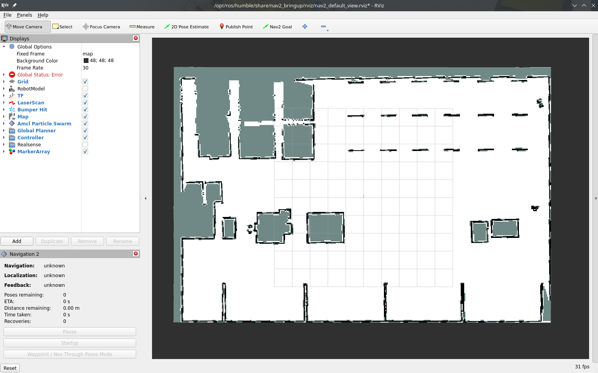
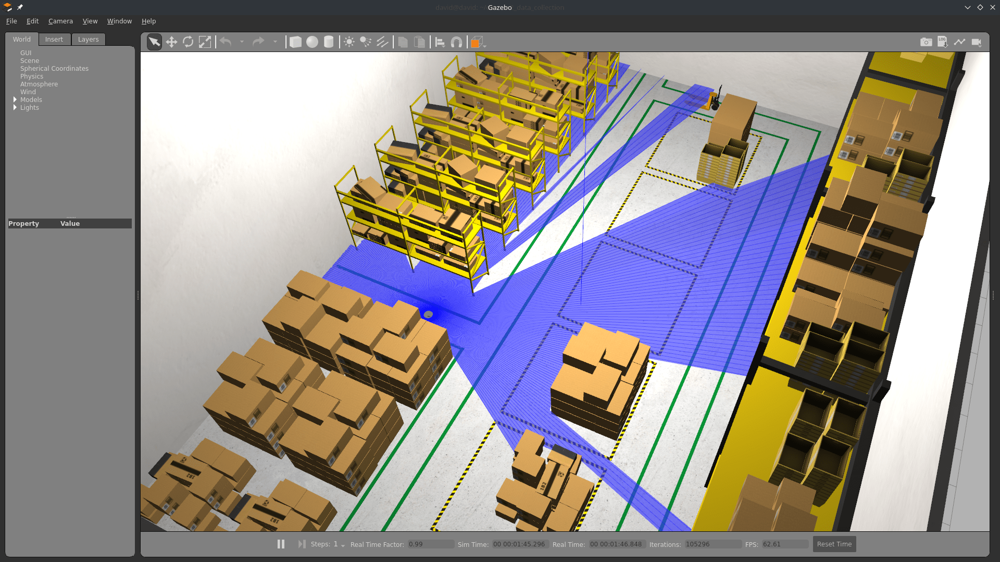
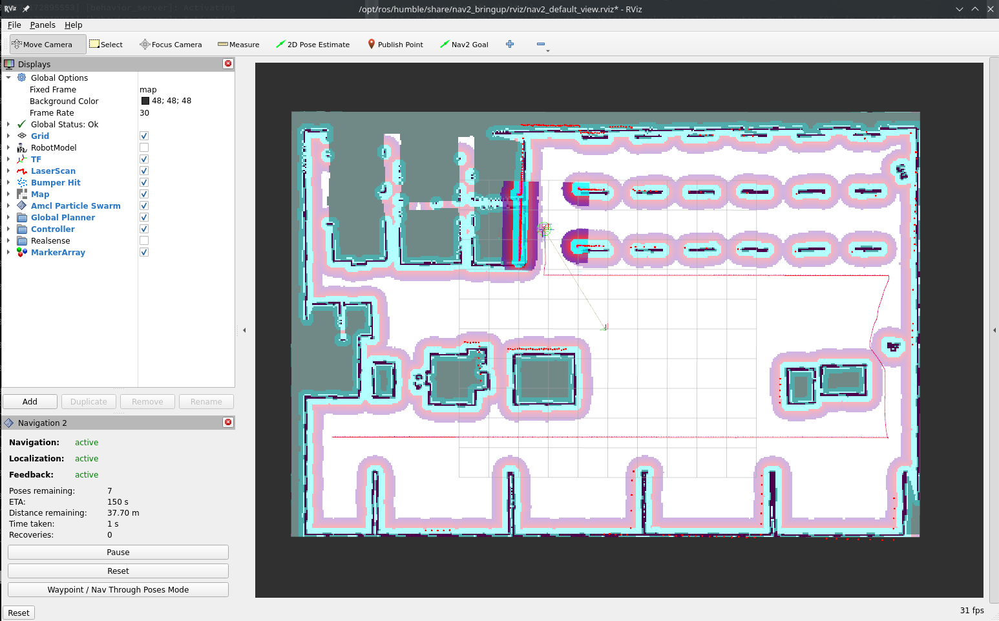
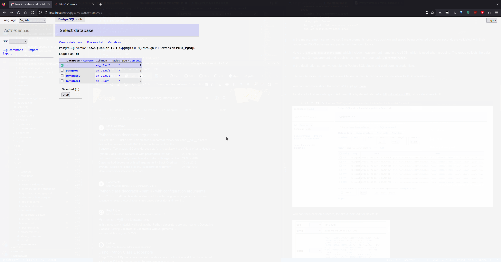
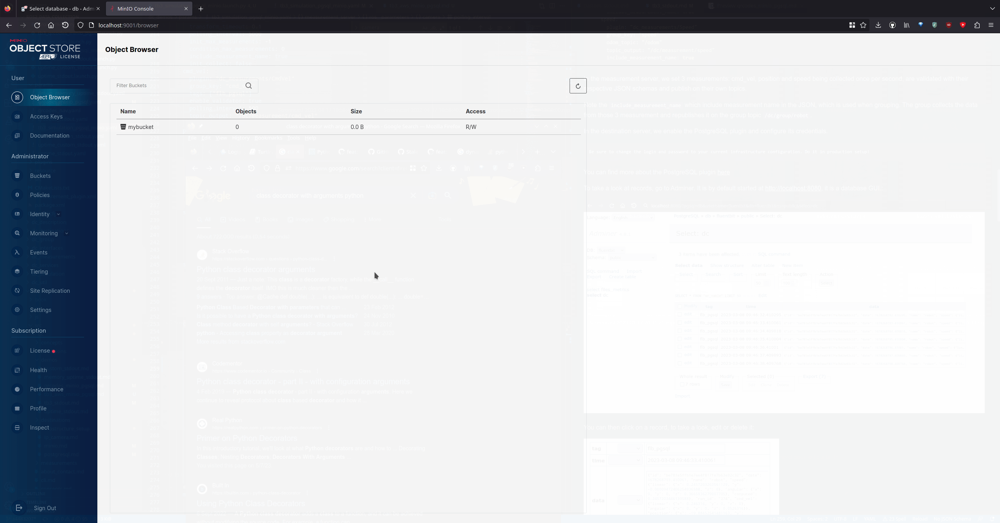

# Turtlebot3

In this example, we add a robot and start collecting robot data to Stdout.

You will also need 3 terminal windows, to:

1. Run the Nav2 turtlebot3 launchfile: it starts localization, navigation and RViz
2. Run navigation inspection demo
3. Run DC

Using a different terminal window for DC helps reading its information.

## Packages in the workspace

In addition to the ros2_data_collection repo in your workspace, you will need to download the [aws warehouse package](https://github.com/aws-robotics/aws-robomaker-small-warehouse-world/tree/ros2):

```bash
$ cd src
$ git clone https://github.com/aws-robotics/aws-robomaker-small-warehouse-world.git -b ros2
$ cd ..
$ colcon build
```

## Setup the environment

### Python dependencies

For this tutorial, we will need to install all dependencies:

```bash
$ pip3 install -r requirements.txt -r requirements-dev.txt
```

### Setup Infrastructure

#### MinIO

MinIO will be used as storage for images and other files. To start it, [follow the steps](../infrastructure_setup/minio.md)

Once you have your keys, edit the yaml configuration file at [dc_demos/params/tb3_simulation_pgsql_minio.yaml](https://github.com/Minipada/ros2_data_collection/blob/humble/dc_demos/params/tb3_simulation_pgsql_minio.yaml) by editing all instances of:

1. access_key_id
2. secret_access_key

#### PostgreSQL

PostgreSQL will be used as database storage for our JSON. Later on, backend engineers can make requests on those JSON based on measurement requested and time range. To start it, [follow the steps](../infrastructure_setup/postgresql.md)


The default yaml configuration file does not need change as it also uses default values.

### Setup simulation environment
In the terminal 1, source your environment, setup turtlebot configuration:

```bash
$ source /opt/ros/humble/setup.bash
$ source install/setup.bash
$ export GAZEBO_MODEL_PATH=$GAZEBO_MODEL_PATH:/opt/ros/humble/share/turtlebot3_gazebo/models
$ export GAZEBO_RESOURCE_PATH=${PWD}/src/aws-robomaker-small-warehouse-world/
$ export TURTLEBOT3_MODEL=waffle
$ source /usr/share/gazebo/setup.bash
```

Verify the gazebo world can be loaded properly:

```bash
$ gazebo /opt/ros/humble/share/aws_robomaker_small_warehouse_world/worlds/small_warehouse/small_warehouse.world
```

Gazebo will start with the warehouse environment. You can close it now.

```admonish info

I believe requiring the source along with those export are needed because of [this issue](https://github.com/aws-robotics/aws-robomaker-small-warehouse-world/issues/22)
```

## Terminal 1: Start Navigation

Then, in the same terminal (1), start the Turtlebot launchfile:

```bash
$ ros2 launch nav2_bringup tb3_simulation_launch.py \
    world:=/opt/ros/humble/share/aws_robomaker_small_warehouse_world/worlds/no_roof_small_warehouse/no_roof_small_warehouse.world \
    map:=/opt/ros/humble/share/aws_robomaker_small_warehouse_world/maps/005/map.yaml \
    headless:=False \
    x_pose:=3.45 \
    y_pose:=2.15 \
    yaw:=3.14
```

RViz and Gazebo will start: now you see the robot in Gazebo, and the map on RViz.




## Terminal 2: Start DC

Run colcon build to install the new configuration file:

```bash
$ colcon build
```

Now, start the demo:

```bash
$ ros2 launch dc_demos tb3_simulation_pgsql_minio.launch.py
```

The robot will start collecting data.

## Terminal 3: Start autonomous navigation

Execute

```bash
$ ros2 run nav2_simple_commander demo_security
```

The robot will start moving and you will be able to see all visualizations activated in RViz:



## Visualize the data
### In the database

Navigate to [localhost:8080](http://localhost:8080)

1. Select *dc* database
2. Select *dc* table
3. Click on *Select data*

You will see rows filling the database. You can click on one to see its content:




### In MinIO (file storage)

Navigate to [localhost:9001](http://localhost:9001)

1. Select *mybucket* bucket
2. Click until you reach camera or map
3. Continue until you reached a file, and click on preview (pgm can't be previewed)

You will see rows filling the database. You can click on one to see its content:



### With Streamlit dashboard
A dashboard has been developed to help visualize the data collected.

```admonish warning

Make sure you have install python dependencies with pip!
```

Execute in a new terminal:

```bash
$ cd src/ros2_data_collection/dc_demos/dc_demos/streamlit_dashboard/
# Replace by what was created at the start of this demo
$ export MINIO_ACCESS_KEY=<YOUR_ACCESS_KEY>
# Replace by what was created at the start of this demo
$ export MINIO_SECRET_KEY=<YOUR_SECRET_KEY>
$ streamlit run Streamlit_ROS_2.py

# This will be printed:

  You can now view your Streamlit app in your browser.

  Local URL: http://localhost:8502
  Network URL: http://192.168.2.105:8502
```

Reach the address on your browser: [localhost:8502](http://localhost:8502). Here is a video of it:

<video src="/images/demos-tb3_aws_minio_pgsql-streamlit.webm" controls="controls"></video>

That's it! Now you can collect your data!

## Understanding the configuration

```admonish info
The full configuration file can be found [here](https://github.com/Minipada/ros2_data_collection/blob/humble/dc_demos/params/tb3_simulation_pgsql_minio.yaml).
```

For this demo, we will reconstruct the yaml configuration element by element, given how large it is. Go through the explanation to understand how it works.

### Measurement server
#### Measurements
`measurement_plugins` sets which plugin to load. We collect

System measurements:

1. [CPU](../measurements/cpu.md)
2. [OS](../measurements/os.md)
3. [Memory](../measurements/memory.md)
4. [Uptime](../measurements/uptime.md)

Robot measurements:

1. [Camera images](../measurements/camera.md)
2. [Command velocities](../measurements/cmd_vel.md)
3. [Distance traveled](../measurements/distance_traveled.md)
4. [Positions](../measurements/position.md)
5. [Speed](../measurements/speed.md)

Environment measurements:

1. [Map](../measurements/map.md)

Infrastructure measurements:

1. [MinIO API health](../measurements/tcp_health.md)
2. [MinIO Dashboard health](../measurements/tcp_health.md)
3. [PostgreSQL health](../measurements/tcp_health.md)

Each has their own configuration: polling interval, source topic, destination paths, topics used as input etc. Going through each of them would be too long here but you can check for each measurement its documentation and the general [documentation of measurements](../measurements.md)

#### Conditions

We also initialize conditions:

1. min_distance_traveled
2. max_distance_traveled

They are used in the distance traveled measurement to only take values in a certain range.

### Destination server

Here we enable the PostgreSQL and MinIO plugins since it is where we send the data.

#### PostgreSQL destination

We pass all topics generated by measurements. The node will subscribe to it and transfer the data to PostgreSQL. Note that not all data need to be sent to PostgreSQL, some could be sent elsewhere.

Along with the inputs, we pass the server configuration: username, password, database name etc.

#### MinIO destination

We pass the topics we want to subscribe to. Here only map and camera since those are the ones generating files.

The `src_fields` and `upload_fields` are fields in the JSON sent by the measurement where local and remote paths are stored so the plugin knows where to put the files.
