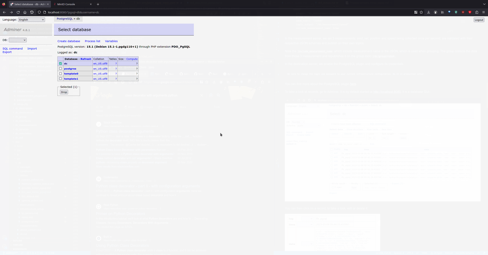

# Turtlebot3

In this example, we add a robot and start collecting robot data to Stdout.

You will also need 3 terminal windows, to:

1. Run the Nav2 turtlebot3 launchfile: it starts localization, navigation and RViz
2. Run navigation inspection demo
3. Run DC

Using a different terminal window for DC helps reading its information.

## Packages in the workspace

In addition to the ros2_data_collection repo in your workspace, you will need to download the [aws warehouse package](https://github.com/aws-robotics/aws-robomaker-small-warehouse-world/tree/ros2):

```bash
cd src
git clone https://github.com/aws-robotics/aws-robomaker-small-warehouse-world.git -b ros2
cd ..
colcon build
```

## Setup the environment

### Python dependencies

For this tutorial, we will need to install all dependencies, the demo dashboard's
included ([uv](https://docs.astral.sh/uv/) owns them; see [Setup](../setup.md)):

```bash
uv sync
```

### Setup Infrastructure
#### RustFS

RustFS will be used as storage for images and other files. To start it, [follow the steps](../infrastructure_setup/rustfs.md) — a single RustFS container plus a one-shot container that bootstraps the `dc-files` bucket, using the default `rustfsadmin`/`rustfsadmin` credentials this demo's params file already assumes. No manual bucket or key setup is needed, unlike the old 4-node MinIO cluster + nginx console this replaces.

#### PostgreSQL

PostgreSQL will be used as database storage for our JSON. Later on, backend engineers can make requests on those JSON based on measurement requested and time range. To start it, [follow the steps](../infrastructure_setup/postgresql.md)

The default yaml configuration file does not need change as it also uses default values.

```admonish info
`tools/infrastructure/docker/config/postgresql/init.sql` pre-creates the `dc` and `dc_files` tables Vector's `postgres` sink writes into — it maps each Record's top-level JSON keys onto existing columns of the same name rather than creating them itself. See the file's header comment for the full column reference.
```

### Setup simulation environment
In the terminal 1, source your environment:

```bash
source /opt/ros/jazzy/setup.bash
source install/setup.bash
```

Nothing else has to be exported. `dc_simulation` puts its own models and worlds on
`GZ_SIM_RESOURCE_PATH` through its environment hook.

```admonish info
This demo used to run `aws_robomaker_small_warehouse_world` under Gazebo Classic. That
package has no Jazzy release — its own jazzy branch still hard-depends on `gazebo_ros`,
which was never published for Jazzy. The warehouse now comes from `dc_simulation`
instead, which vendors the same AWS RoboMaker props (shelves, clutter, trash cans) into
a gz-sim world of its own.
```

## Terminal 1: Start Navigation

Then, in the same terminal (1), start the simulation and Nav2. DC comes up separately in
terminal 2, so turn it off here:

```bash
ros2 launch dc_demos tb3_qrcodes.launch.py \
    headless:=False \
    use_dc:=False
```

RViz and gz-sim will start: now you see the robot in the warehouse, and the map on RViz.
AMCL sets the initial pose itself, so there is no need to click "2D Pose Estimate".

```admonish warning
The warehouse world is heavy — 317 model instances. Expect a slow start and a real-time
factor well under 1 without a GPU; see `dc_simulation/README.md` for measured numbers.
```


## Terminal 2: Start DC

Run colcon build to compile the workspace:

```bash
colcon build
```

Now, start the demo:

```bash
ros2 launch dc_demos tb3_simulation_pgsql_minio.launch.py
```

The robot will start collecting data.

## Terminal 3: Start autonomous navigation

Execute

```bash
ros2 run nav2_simple_commander demo_security
```

The robot will start moving and you will be able to see all visualizations activated in RViz:


## Visualize the data
### In the database

Navigate to [localhost:8080](http://localhost:8080)

1. Select *dc* database
2. Select *dc* table
3. Click on *Select data*

You will see rows filling the database. You can click on one to see its content:



### With Grafana

Only two Grafana dashboards ship with the DC 2.0 infrastructure now — **Home** and **Robot** (the System/Environment/Infrastructure dashboards were dropped as out of scope for this minimal rework). Open [http://localhost:3000](http://localhost:3000) (admin/admin) and pick the **Robot** dashboard: its panels are backed by SQL queries against the `dc`/`dc_files` PostgreSQL tables — the Grafana datasource is PostgreSQL (uid `dc_postgres`) now, not InfluxDB. It shows, among other things, speed/command velocity over time and a table of uploaded inspection files with their RustFS + PostgreSQL upload status:

```sql
SELECT to_timestamp(updated_at) AS "time", group_name, robot_name, storage_type, remote_path, content_type, size, uploaded
FROM dc_files WHERE kind = 'file_status' ORDER BY updated_at DESC LIMIT 100
```

See `tools/infrastructure/docker/config/grafana/dashboards/robot.json` for every panel's exact query.

That's it! Now you can collect your data!

## Understanding the configuration

```admonish info
The full configuration file can be found [here](https://github.com/Minipada/ros2_data_collection/blob/jazzy/dc_demos/params/tb3_simulation_pgsql_minio.yaml).
```

### Measurement server
#### Measurements
`measurement_plugins` sets which plugin to load. We collect

System measurements:

1. [CPU](../measurements/cpu.md)
2. [OS](../measurements/os.md)
3. [Memory](../measurements/memory.md)
4. [Uptime](../measurements/uptime.md)

Robot measurements:

1. [Camera images](../measurements/camera.md)
2. [Command velocities](../measurements/cmd_vel.md)
3. [Distance traveled](../measurements/distance_traveled.md)
4. [Positions](../measurements/position.md)
5. [Speed](../measurements/speed.md)

Environment measurements:

1. [Map](../measurements/map.md)

Infrastructure measurements:

1. [RustFS health](../measurements/tcp_health.md)
2. [PostgreSQL health](../measurements/tcp_health.md)

Each has their own configuration: polling interval, source topic, destination paths, topics used as input etc. Going through each of them would be too long here but you can check for each measurement its documentation and the general [documentation of measurements](../measurements.md)

```admonish info
The old MinIO setup needed two separate TCP health checks — `minio_api_health` (port 9000) and `minio_dashboard_health` (port 9001) — because it ran a 4-node MinIO cluster fronted by an nginx console. This demo's single RustFS container exposes only its API port, so it collapses to one `rustfs_health` check on port 9000; there is no separate console port to probe here.
```

```yaml
measurement_server:
  ros__parameters:
    ...
    camera:
      plugin: "dc_measurements/Camera"
      cam_topic: "/intel_realsense_r200_depth/image_raw"
      cam_name: "Intel Realsense"
      save_raw_img: true
      save_raw_path: "camera/raw/%Y-%m-%dT%H-%M-%S"
      remote_prefixes: [""]
      remote_keys: ["rustfs"]
      ...
    map:
      plugin: "dc_measurements/Map"
      save_path: "map/%Y-%m-%dT%H-%M-%S"
      topic_output: "/dc/measurement/map"
      remote_prefixes: [""]
      remote_keys: ["rustfs"]
      ...
    rustfs_health:
      plugin: "dc_measurements/TCPHealth"
      topic_output: "/dc/measurement/rustfs_health"
      polling_interval: 5000
      host: "127.0.0.1"
      port: 9000
      name: "RustFS"
      include_measurement_plugin: true
    pgsql_health:
      plugin: "dc_measurements/TCPHealth"
      topic_output: "/dc/measurement/pgsql_health"
      polling_interval: 5000
      host: "127.0.0.1"
      port: 5432
      name: "PostgreSQL"
      include_measurement_plugin: true
```

#### Conditions

We also initialize conditions:

1. min_distance_traveled
2. max_distance_traveled

They are used in the distance traveled measurement to only take values in a certain range.

### Destination server

Here we enable the `pgsql`, `pgsql_files` and `rustfs` Destinations:

```yaml
dc_bridge:
  ros__parameters:
    shipper:
      data_dir: "$HOME/.dc/buffer"
    destinations: ["pgsql", "pgsql_files", "rustfs"]
    pgsql:
      type: postgres
      receives: records
      inputs: [
          # System
          "/dc/measurement/cpu",
          "/dc/measurement/memory",
          "/dc/measurement/os",
          "/dc/measurement/uptime",
          # Robot
          "/dc/measurement/camera",
          "/dc/measurement/cmd_vel",
          "/dc/measurement/distance_traveled",
          "/dc/measurement/position",
          "/dc/measurement/speed",
          # Environment
          "/dc/measurement/map",
          # Infrastructure
          "/dc/measurement/rustfs_health",
          "/dc/measurement/pgsql_health",
        ]
      host: "127.0.0.1"
      port: 5432
      user: "dc"
      password: "password"
      database: "dc"
      table: "dc"
      time_key: "date"
      time_format: "double"
    pgsql_files:
      type: postgres
      receives: records
      host: "127.0.0.1"
      port: 5432
      user: "dc"
      password: "password"
      database: "dc"
      table: "dc_files"
      time_key: "date"
      time_format: "double"
    rustfs:
      type: s3
      receives: files
      inputs: ["/dc/measurement/map", "/dc/measurement/camera"]
      bucket: "dc-files"
      endpoint: "http://127.0.0.1:9000"
      region: "us-east-1"
      access_key_id: "rustfsadmin"
      secret_access_key: "rustfsadmin"
      force_path_style: true
    files:
      delete_when_sent: true
      metadata_destination: "pgsql_files"
```

#### PostgreSQL Destinations

`pgsql` carries almost every measurement and the two infrastructure health checks as plain Records. Note that not all data needs to go to PostgreSQL — only topics listed in a Destination's `inputs` reach it.

`pgsql_files` is a second, dedicated `postgres` Destination for the Bridge's Uploader status Records — it has no `inputs` of its own; it only receives data because `files.metadata_destination` names it. See [Destinations](../destinations.md) and [ADR-0005](https://github.com/Minipada/ros2_data_collection/blob/jazzy/docs/adr/0005-file-uploads-are-bridge-responsibility.md) for the full split, and the [QR codes demo](./qrcodes_minio_pgsql.md) for a worked example of the same pattern.

#### RustFS Destination

We list only `map` and `camera` in `rustfs`'s `inputs` since those are the only measurements referencing Files. `rustfs`'s `type: s3` and `receives: files` mark it as Uploader-owned rather than a Vector sink target: it uploads whatever File the measurement's `remote_keys: ["rustfs"]` pointed at it, verifies the object landed, and (with `files.delete_when_sent: true`) deletes the local copy only once that's confirmed.
