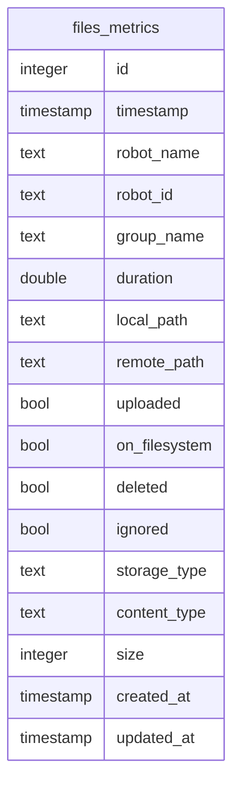

# Files metrics - Fluent Bit

## Description

Tracks files (yaml files, jpg pictures etc.) sent to their destinations (s3, minio etc.). We can then delete files locally when they have been sent to all their storage destinations.

It loads a Fluent Bit plugin we wrote ourselves to do this task, located in the fluent_bit_plugins package.

It creates a table on the database (currently PostgreSQL only) to store each file status.



## Parameters

| Parameter                   | Description                                     | Type                   | Default                                                              |
| --------------------------- | ----------------------------------------------- | ---------------------- | -------------------------------------------------------------------- |
| **db_type**                 | Database used.                                  | str                    | "pgsql"                                                              |
| **file_storage**            | Where data will be stored.                      | list\[str\](s3, minio) | N/A (Mandatory)                                                      |
| **delete_when_sent**        | Delete file when sent.                          | bool                   | true                                                                 |
| **minio.access_key_id**     | Minio Access key ID.                            | str                    | N/A (Mandatory)                                                      |
| **minio.bucket**            | Minio bucket name.                              | str                    | "dc_bucket"                                                          |
| **minio.endpoint**          | Minio endpoint.                                 | str                    | "127.0.0.1:9000"                                                     |
| **minio.secret_access_key** | Minio Secret access key.                        | str                    | N/A (Mandatory)                                                      |
| **minio.src_fields**        | JSON fields containing local paths for Minio.   | str                    | N/A (Mandatory)                                                      |
| **minio.upload_fields**     | JSON fields containing remote paths for Minio.  | str                    | N/A (Mandatory)                                                      |
| **minio.use_ssl**           | Use SSL for Minio.                              | bool                   | true                                                                 |
| **plugin_path**             | Shared library path compiled by go.             | str                    | "{package_share_directory}/flb_plugins/lib/flb-out_files_metrics.so" |
| **pgsql.database**          | Database name to connect to.                    | str                    | <system_username>                                                    |
| **pgsql.host**              | Hostname/IP address of the PostgreSQL instance. | str                    | "127.0.0.1"                                                          |
| **pgsql.password**          | Password of PostgreSQL username.                | str                    | ""                                                                   |
| **pgsql.port**              | PostgreSQL port.                                | str                    | "5432"                                                               |
| **pgsql.ssl**               | Use ssl for PostgreSQL connection.              | bool                   | true                                                                 |
| **pgsql.table**             | Table name where to store data.                 | str                    | "pg_table"                                                           |
| **pgsql.user**              | PostgreSQL username.                            | str                    | <system_username>                                                    |
| **plugin_path**             | Shared library of the plugin.                   | str                    | <install_path>/lib/out_files_metrics.so                              |
| **s3.access_key_id**        | S3 Access key ID.                               | str                    | N/A (Mandatory)                                                      |
| **s3.bucket**               | S3 bucket name.                                 | str                    | N/A (Mandatory)                                                      |
| **s3.endpoint**             | S3 endpoint.                                    | str                    | N/A (Mandatory)                                                      |
| **s3.secret_access_key**    | S3 Secret access key.                           | str                    | N/A (Mandatory)                                                      |
| **s3.src_fields**           | JSON fields containing local paths for s3.      | str                    | N/A (Mandatory)                                                      |
| **s3.upload_fields**        | JSON fields containing remote paths for S3.     | str                    | N/A (Mandatory)                                                      |

## Example
```yaml
flb_files_metrics:
    plugin: "dc_destinations/FlbFilesMetrics"
    inputs: ["/dc/group/map"]
    file_storage: ["minio", "s3"]
    db_type: "pgsql"
    debug: true
    delete_when_sent: true
    minio:
        endpoint: 127.0.0.1:9000
        access_key_id: XEYqG4ZcPY5jiq5i
        secret_access_key: ji011KCtI82ZeQS6UwsQAg8x9VR4lSaQ
        use_ssl: false
        bucket: "mybucket"
        src_fields: ["map.local_paths.pgm", "map.local_paths.yaml"]
        upload_fields: ["map.minio_paths.pgm", "map.minio_paths.yaml"]
    s3:
        endpoint: 127.0.0.1:9000
        access_key_id: XEYqG4ZcPY5jiq5i
        secret_access_key: ji011KCtI82ZeQS6UwsQAg8x9VR4lSaQ
        bucket: "mybucket"
        src_fields: ["map.local_paths.yaml"]
        upload_fields: ["map.s3_paths.yaml"]
    pgsql:
        host: "127.0.0.1"
        port: "5432"
        user: fluentbit
        password: password
        database: "fluentbit"
        table: "files_metrics"
        timestamp_key: "date"
        time_format: "double"
        time_key: "date"
        ssl: false
```
