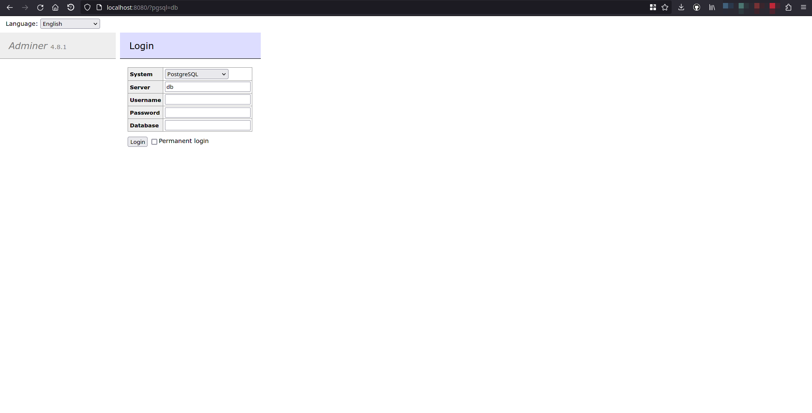

# Adminer

## Description
Adminer (formerly phpMinAdmin) is a full-featured database management tool written in PHP. Conversely to phpMyAdmin, it consist of a single file ready to deploy to the target server. Adminer is available for MySQL, MariaDB, PostgreSQL, SQLite, MS SQL, Oracle, Elasticsearch, MongoDB and others via plugin

## Start with docker compose
Execute:

```bash
$ ./tools/infrastructure/scripts/install_infrastructure.bash \
  --tool=adminer \
  --install-type=docker
```

## Start natively
```bash
$ ./tools/infrastructure/scripts/install_infrastructure.bash \
  --tool=adminer \
  --install-type=native
```

## Credentials

| Type                | User | Password | Database | Port |
| ------------------- | ---- | -------- | -------- | ---- |
| PostgreSQL (Native) | dc   | password | dc       | 80   |
| PostgreSQL (Docker) | dc   | password | dc       | 8080 |

## How to use
Natively, by accessing [http://localhost:80/adminer](http://localhost:80/adminer), and in docker, by accessing [http://localhost:8080](http://localhost:8080), you will be able to see this page:


