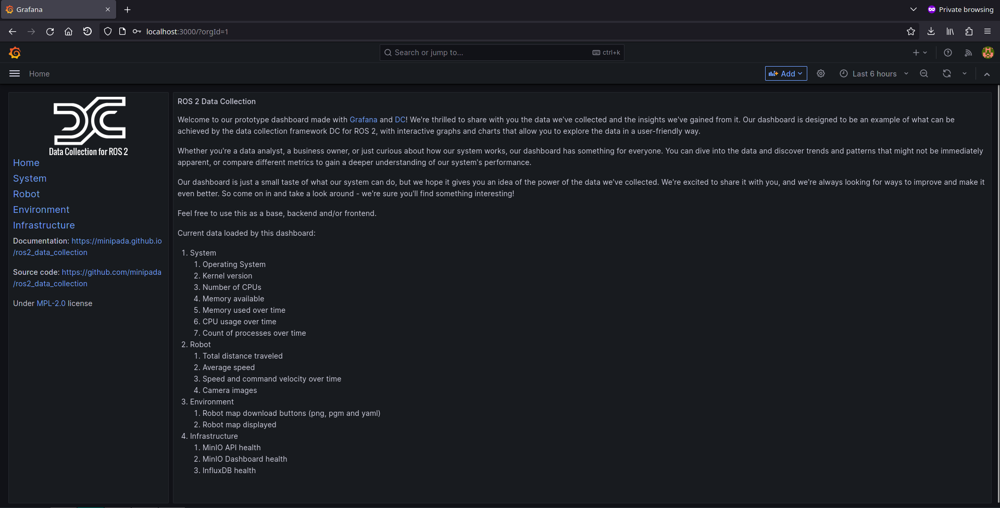

# Grafana

## Description
[Grafana](https://grafana.com/) is a multi-platform open source analytics and interactive visualization web application. It provides charts, graphs, and alerts for the web when connected to supported data sources.

## Start with docker compose
Execute:

```bash
./tools/infrastructure/scripts/install_infrastructure.bash \
  --tool=grafana \
  --install-type=docker
```

## Start natively
```bash
./tools/infrastructure/scripts/install_infrastructure.bash \
  --tool=grafana \
  --install-type=native
```

## What comes up with it

Datasource and dashboards are provisioned from
`tools/infrastructure/docker/config/grafana/` — no manual import. The PostgreSQL datasource
(uid `dc_postgres`) points at the [PostgreSQL](./postgresql.md) container, and three
dashboards ship: **Home**, **Robot**, and **KPI** (availability and uptime, backed by the
[KPI views](../kpi_views.md)).

## Credentials

| User  | Password | Port |
| ----- | -------- | ---- |
| admin | admin    | 3000 |

## How to use
Open [http://localhost:3000](http://localhost:3000) and log in; the provisioned dashboards are under *Dashboards*:


