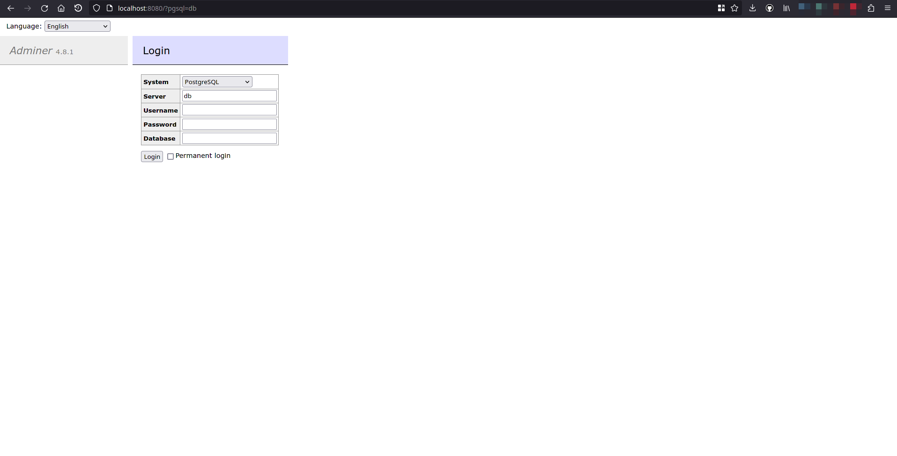

# MinIO

## Requirements

1. Docker installed
2. Docker compose installed

## Description

MinIO is an object storage solution that provides an Amazon Web Services S3-compatible API and supports all core S3 features. MinIO is built to deploy anywhere - public or private cloud, baremetal infrastructure, orchestrated environments, and edge infrastructure.

## Start with Docker compose
Execute:

```bash
$ ./tools/infrastructure/scripts/install_infrastructure.bash --tool=pgsql --install-type=docker
```

This will start PostgreSQL and Adminer (a GUI to see and interact with the database)

By accessing [localhost:8080](http://localhost:8080), you should be able to see this page:



Server: *localhost*
Username: *dc*
Password: *password*
Database: *dc*
