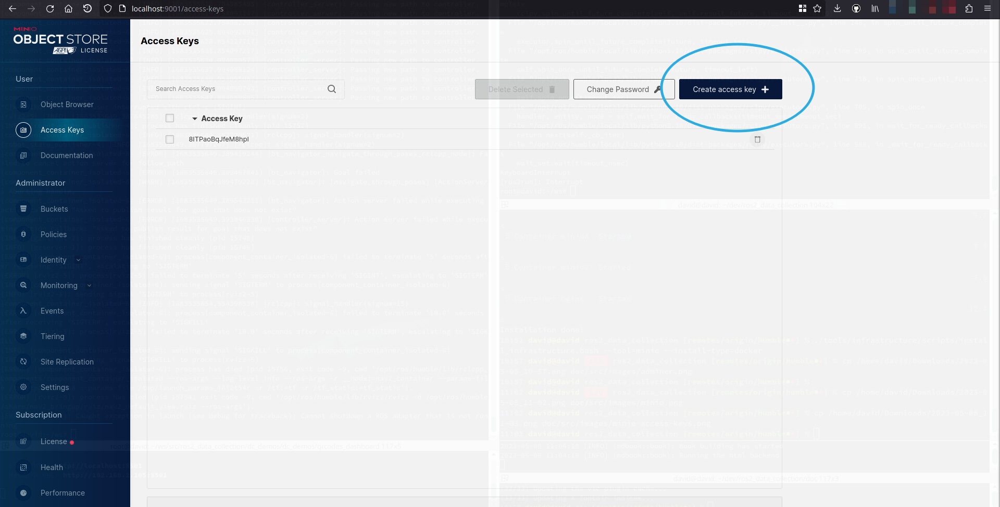

# MinIO

## Requirements

1. Docker installed
2. Docker compose installed

## Description

MinIO is an object storage solution that provides an Amazon Web Services S3-compatible API and supports all core S3 features. MinIO is built to deploy anywhere - public or private cloud, baremetal infrastructure, orchestrated environments, and edge infrastructure.

## Start with Docker compose
Execute:

```bash
./tools/infrastructure/scripts/install_infrastructure.bash \
  --tool=minio \
  --install-type=docker
```

## Start natively
```bash
./tools/infrastructure/scripts/install_infrastructure.bash \
  --tool=minio \
  --install-type=native
```

## How to use
This will start MinIO API and dashboard (a GUI to see and interact with the data)

By accessing [localhost:9001](http://localhost:9001), you should be able to see this page:


Username: *minioadmin*
Password: *minioadmin*

## Create an access key

Go to the Access Keys page and click on "Create access key"



Take note of the access and secret key and add them in your required launch file configuration late on.

## Credentials

| User       | Password   | Port       |
| ---------- | ---------- | ---------- |
| minioadmin | minioadmin | 9000, 9001 |
