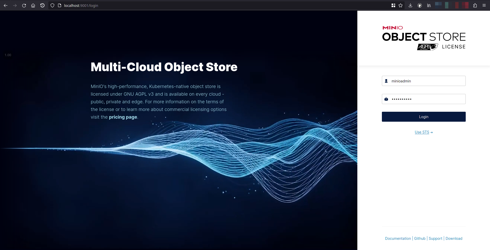
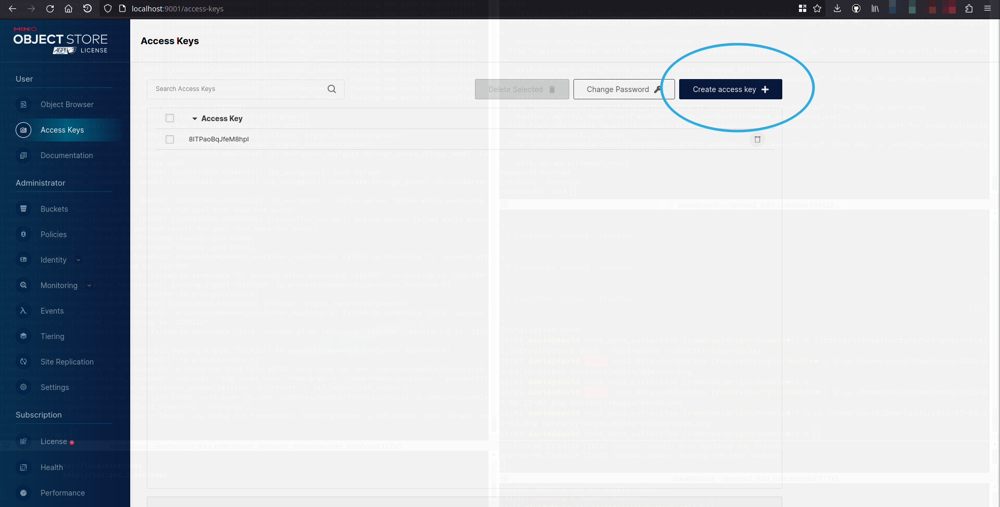

# PostgreSQL
## Requirements

1. Docker installed
2. Docker compose installed

## Description
PostgreSQL is a powerful, open source object-relational database system that uses and extends the SQL language combined with many features that safely store and scale the most complicated data workloads. The origins of PostgreSQL date back to 1986 as part of the POSTGRES project at the University of California at Berkeley and has more than 35 years of active development on the core platform.

## Start with docker compose
Execute:

```bash
$ ./tools/infrastructure/scripts/install_infrastructure.bash --tool=minio --install-type=docker
```

This will start MinIO API and dashboard (a GUI to see and interact with the data)

By accessing [localhost:9001](http://localhost:9001), you should be able to see this page:



Username: *minioadmin*
Password: *minioadmin*

## Create an access key

Go to the Access Keys page and click on "Create access key"



Take note of the access and secret key and add them in your required launch file configuration late on.
