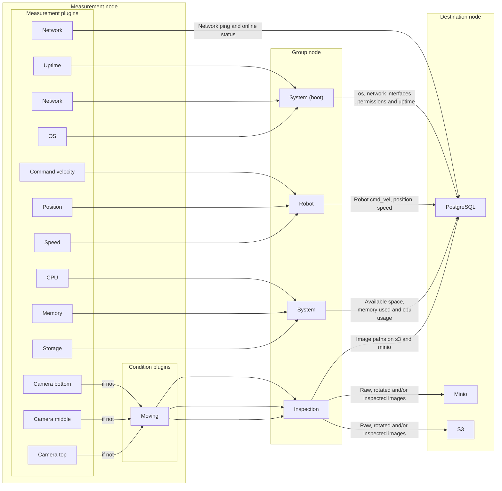

# DC

  

**Documentation**: [https://minipada.github.io/ros2_data_collection](https://minipada.github.io/ros2_data_collection)

**Source code**: [https://github.com/minipada/ros2_data_collection](https://github.com/minipada/ros2_data_collection)

  

 

| Humble                                                                                                                                                                                                                        |
| ----------------------------------------------------------------------------------------------------------------------------------------------------------------------------------------------------------------------------- |
|                                          |
|                                          |
|                                         |
|  |
|                                                      |

For detailed instructions:

- [Build](https://minipada.github.io/ros2_data_collection/dc/setup.html)
- [Concepts](https://minipada.github.io/ros2_data_collection/dc/concepts.html)
- [Data Pipeline](https://minipada.github.io/ros2_data_collection/dc/data_pipeline.html)
- [Measurements](https://minipada.github.io/ros2_data_collection/dc/measurements.html)
- [Conditions](https://minipada.github.io/ros2_data_collection/dc/conditions.html)
- [Data validation](https://minipada.github.io/ros2_data_collection/dc/data_validation.html)
- [Groups](https://minipada.github.io/ros2_data_collection/dc/groups.html)
- [Destinations](https://minipada.github.io/ros2_data_collection/dc/destinations.html)
- [Configuration examples](https://minipada.github.io/ros2_data_collection/dc/configuration_examples.html)
- [Getting started](https://minipada.github.io/ros2_data_collection/dc/getting_started.html)
- [Infrastructure setup](https://minipada.github.io/ros2_data_collection/dc/infrastructure_setup.html)
- [CLI tools](https://minipada.github.io/ros2_data_collection/dc/cli.html)
- [Future work and Roadmap](https://minipada.github.io/ros2_data_collection/dc/future_work.html)
- [Contributing](https://minipada.github.io/ros2_data_collection/dc/contributing.html)
- [FAQ](https://minipada.github.io/ros2_data_collection/dc/faq.html)
- [About and contact](https://minipada.github.io/ros2_data_collection/dc/about_contact.html)

## Introduction

The DC (Data Collection) project aims at integrating data collection pipelines into ROS 2. The goal is to integrate data collection pipelines with existing APIs to enable data analytics, rather than live monitoring, which already has excellent tools available. As companies increasingly turn to autonomous robots, the ability to understand and improve operations for any type of machine in any environment has become crucial. This involves mostly pick and drop and inspection operations. This framework aims at helping collecting, validating (through JSON schemas) and sending reliably the data to create such APIs and dashboards.

DC uses a modular approach, based on [pluginlib](https://index.ros.org/p/pluginlib/) and greatly inspired by [Nav2](https://navigation.ros.org/) for its architecture. Pluginlib is used to configure which measurements are collected and where the data goes. Measurements and destinations are pluginlib plugins. In addition to pluginlib, most plugins use [Fluent bit](https://fluentbit.io/) in the backend: *Fluent Bit is a super fast, lightweight, and highly scalable logging and metrics processor and forwarder. It is the preferred choice for cloud and containerized environments. Developed and interfaced in C, it has already many features we directly can use, especially: high performance, reliability and data integrity (backpressure handling and data buffering in memory and filesystem)*.

## Why collect data from robots?

1. **Performance Monitoring**: Collecting data from a robot allows you to monitor its performance and identify areas for improvement. For example, you can use data to analyze the robot's motion and identify areas where it may be experiencing issues or inefficiencies.
2. **Fault Diagnosis**: Data collection can also be used to diagnose faults and troubleshoot issues with the robot. By collecting data on various aspects of the robot's behavior, you can identify patterns or anomalies that may indicate problems with the system.
3. **Machine Learning**: Data collected from robots can be used to train machine learning models, which can be used to improve the robot's performance and behavior. For example, you can use data collected from sensors to train models for object detection or path planning.
4. **Research and Development**: Data collection is important for research and development in robotics. By collecting data on the behavior of robots in different scenarios, researchers can gain insights into how robots can be designed and optimized for different applications.
5. **Inventory Management**: Data collection can be used to monitor inventory levels and track the movement of goods within a warehouse. This can help managers identify which products are in high demand and optimize the placement of products to improve order fulfillment times.
6. **Resource Allocation**: Data collection can also help managers allocate resources more efficiently. For example, by monitoring the movement of people and goods within a warehouse, managers can identify bottlenecks and areas of congestion and adjust staffing and equipment allocation to address these issues.
7. **Process Improvement**: Data collection can be used to monitor and analyze the performance of various processes within a warehouse. By identifying areas of inefficiency or errors, managers can develop strategies for improving these processes and increasing productivity.
8. **Predictive Maintenance**: Data collection can be used to monitor the performance of equipment and identify potential maintenance issues before they occur. This can help managers schedule maintenance more effectively and avoid costly downtime due to equipment failure.

## Main features

* **Open source**: Currently all tools on the market are not open source. This project is in [MPL-2.0 license](https://www.mozilla.org/en-US/MPL/2.0/), in summary you can use without asking permission and without paying
* **Modular approach**: based on pluginlib and greatly inspired by Nav2 for its architecture
* **Reliable data collection**: validate and send data to create APIs and dashboards
* **Flexible data collection**: set polling interval for each measurement or collect every measurement with StringStamped messages
* **Customizable validation**: validate data using existing or customized JSON schemas
* **Easy to extend**: add new measurements or destinations by simply adding a plugin
* **Flexible data collection conditions**: collect data based on conditions such as whether the robot is moving or if a field is equal to a value
* **Trigger-based data collection**: collect data when a defined set of combination of all, any, or no condition are met
* **Customizable record collection**: configure the number of records to collect at the start and when a condition is activated.
* **Data inspection**: inspect data from camera input including barcode and QR codes
* **Fast and efficient**: high performance, using Fluent Bit for backend processing, and designed to minimize code duplication and reduce human errors
* **Grouped measurements**: measurements can be grouped using the group node based on the ApproximateTimeSynchronizer
* **File saving**: files can be saved, including map_server maps, camera images, and any file produced by a measurement
* **Easy to use**: designed to be easy to learn and use
* **No C++ 3rd party library required**: all 3rd party libraries have a vendor package in the repository

And inherited from Fluent Bit:

* [Backpressure handling](https://docs.fluentbit.io/manual/v/1.0/configuration/backpressure)
* [Data buffering in memory and filesystem](https://docs.fluentbit.io/manual/v/1.0/configuration/buffering)

Here is an example of a pipeline:

# License
This program is under the terms of the [Mozilla Public License Version 2.0](https://www.mozilla.org/en-US/MPL/2.0/).

# About and Contact

For any inquiry, please contact David ([d.bensoussan@proton.me](mailto:d.bensoussan@proton.me)). If your inquiry relates to bugs or open-source feature requests, consider posting a ticket on our GitHub project. If your inquiry relates to configuration support or private feature development, reach out and we will be able to support you in your projects.
