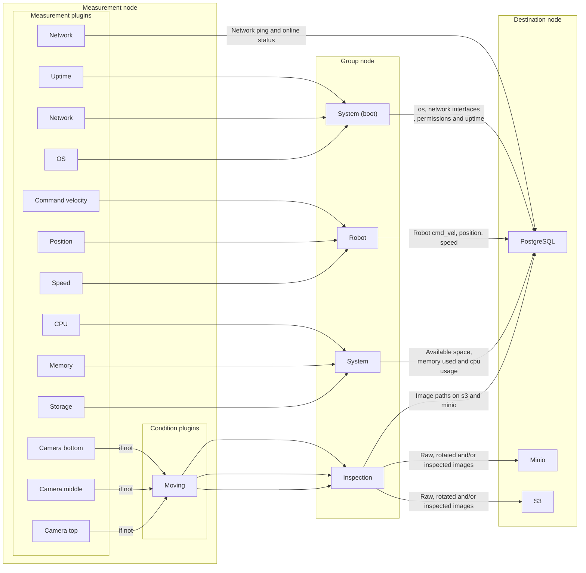

# Introduction

The DC project aims at integrating data collection pipelines into ROS2. This is meant to plug to existing APIs, for analytics, not for live monitoring (some awesome tools exist already). There is currently no generic ROS based framework used to collect data from ROS based robots that are aimed at being analyzed (ros bags are great for developers but not for other software developers who don't know about ROS). Understanding and improving operations for any type of machine in any environment has become an important reason companies move to autonomous robots. This involves mostly pick and drop and inspection operations. This framework aims at giving the data to create such APIs and dashboards.

DC uses a modular approach, based on [pluginlib](https://index.ros.org/p/pluginlib/) and greatly inspired of [Nav2](https://navigation.ros.org/) for its architecture. Pluginlib is used to configure which measurements are collected and where the data goes. Measurements and destinations are pluginlib plugins. In addition to pluginlib, all current plugins use [Fluent bit](https://fluentbit.io/) in the backend: *Fluent Bit is a super fast, lightweight, and highly scalable logging and metrics processor and forwarder. It is the preferred choice for cloud and containerized environments. Developed and interfaced in C, it has already many features we directly can use, especially: high performance, reliability and data integrity (backpressure handling and data buffering in memory and filesystem)*.

# Main features

* Can set polling interval for each measurement
* Data is transported as JSON through ROS messages
* Each measurement data can be validated through JSON schemas (based on [JSON schema 07](https://json-schema.org/draft-07/json-schema-release-notes.html))
* Adding a new measurement or destination requires only to add a plugin
* Can also get from any ROS topics if published as a StringStamped message, then use the StringStamped plugin
* Can exclude JSON fields for each measurement
* Data can be collected on conditions, e.g the robot is moving. Conditions are also plugins in the measurement node
* Data collection can be triggered if all, any or no condition are met
* Can configure number of samples to collect at start and when condition is activated
* No 3rd party library to install: All 3rd party libraries have a [vendor](https://answers.ros.org/question/332915/what-does-the-_vendor-suffix-mean-in-a-package-name/) package and all python code uses the standard library.
* Fluent bit outputs can be added by using the GO or C interface. A Fluent bit plugin needs to be written in this case
* Measurements can be grouped using the group node based on the ApproximateTimeSynchronizer
* Groups can exclude data

Some other features related to some plugins:
* Data inspection is included in the camera input plugin. Currently, only barcode and QR codes can be analyzed.

And inherited from Fluent Bit and ROS2:

* [Backpressure handling](https://docs.fluentbit.io/manual/v/1.0/configuration/backpressure)
* [Data buffering in memory and filesystem](https://docs.fluentbit.io/manual/v/1.0/configuration/buffering)

