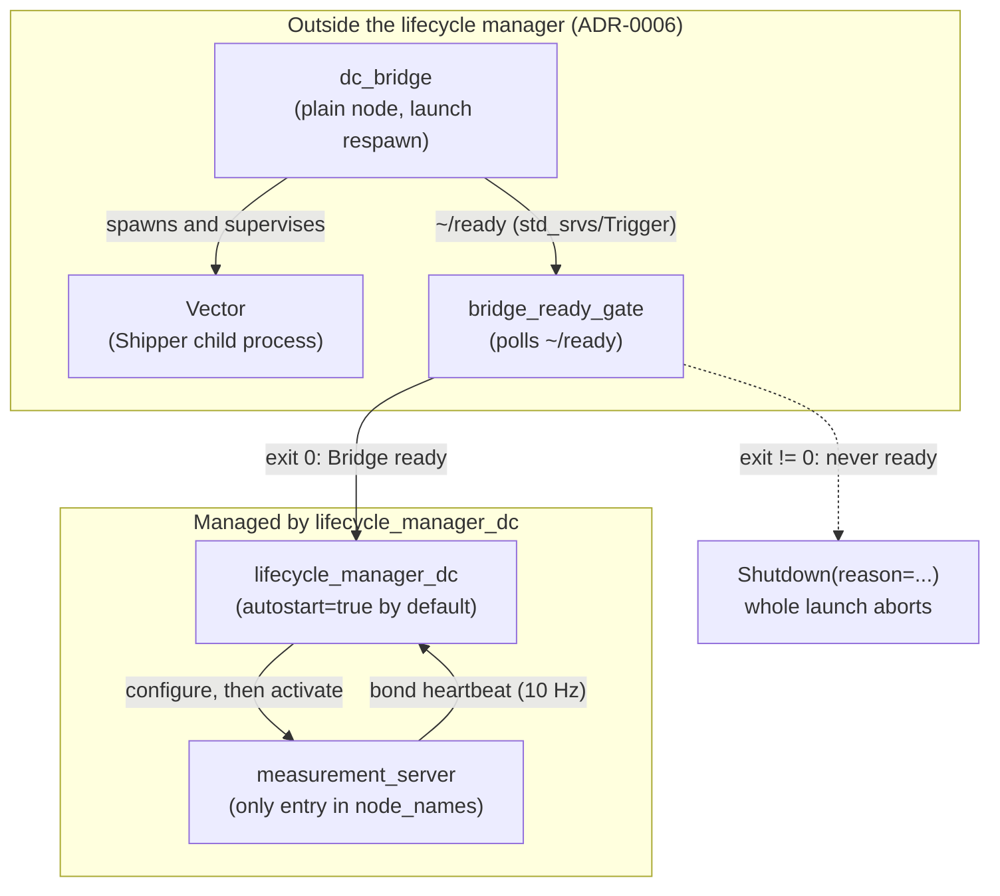
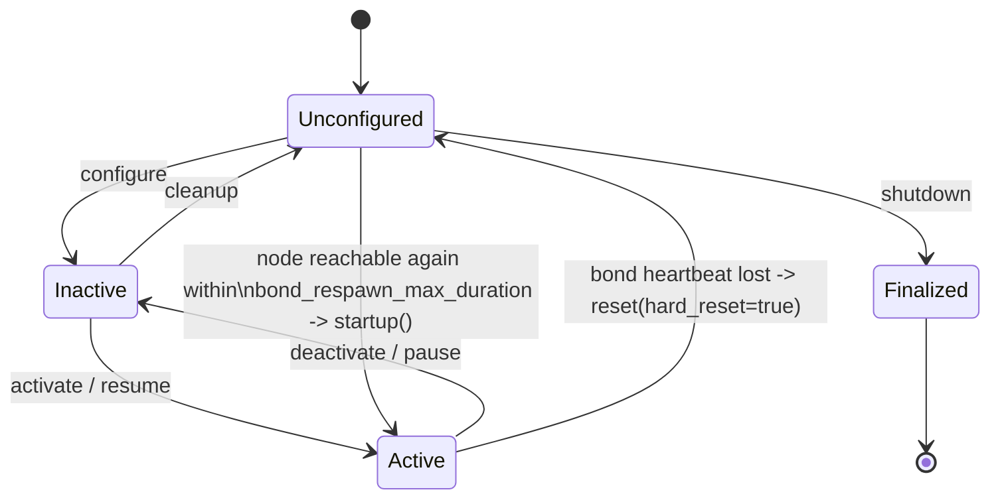

# Lifecycle Manager

`dc_lifecycle_manager` is DC's nav2-style manager for the nodes that have a meaningful
deactivated state. It walks each managed node through the ROS 2 [managed-node state
machine](https://design.ros2.org/articles/node_lifecycle.html) (`configure`,
`activate`, `deactivate`, `cleanup`, `shutdown`), watches a bond heartbeat on every node
it has activated, and can bring the whole managed set up automatically at launch. See
[Concepts](./concepts.md#lifecycle-nodes-and-bond) for the general nav2_util
`LifecycleNode` background this page builds on.

```admonish info
The Bridge (`dc_bridge`) is deliberately **not** one of the managed nodes (ADR-0006): it
has no meaningful deactivated state, so its readiness is a launch-ordering problem
instead — see [the boundary and autostart flow](#the-boundary-and-the-autostart-flow)
below.
```

## What it manages

The set of managed nodes is the `node_names` parameter, walked in list order for
bring-up (`configure` then `activate`, each transition applied to every node before the
next one starts) and in reverse order for teardown. In every params file this repo
ships — `dc_bringup.launch.py`'s inline `lifecycle_manager_params` and both E2E harness
params files — that list is:

```yaml
lifecycle_manager_dc:
  ros__parameters:
    node_names: ["measurement_server"]
    transitions: [configure, activate]
```

`measurement_server` is the only node under lifecycle management today.
`group_server`, when enabled, is launched as a plain `Node` alongside it — not added to
`node_names` — so it is not lifecycle-managed. Nothing stops a future `node_names` entry
from adding it if it ever needs a deactivated state; the manager is already list-driven
for exactly that reason.

## The boundary and the autostart flow

`dc_bringup.launch.py` brings the pipeline up in a fixed order (ADR-0006) so that no
Record can be emitted before the Bridge can accept it. The Bridge, its Vector Shipper
child, and the `bridge_ready_gate` process that polls the Bridge's `~/ready`
(`std_srvs/Trigger`) service all run **outside** `lifecycle_manager_dc` — only once the
gate exits `0` does the lifecycle manager exist at all in the launch graph.



1. **Bridge first.** `dc_bridge` starts as a plain node and spawns Vector as a
   supervised child process.
2. **Readiness gate.** `bridge_ready_gate` blocks until `~/ready` answers
   `success=True` (Vector accepting connections on its ingest socket), or its own
   `timeout_s` (default 120 s) expires.
3. **Activation, only on success.** `dc_bringup.launch.py` registers an
   `OnProcessExit` handler on the gate: exit `0` starts `lifecycle_manager_dc`; any
   other exit code shuts the whole launch down (`Shutdown(reason=...)`) instead of
   leaving collection nodes running against a Bridge that never came up.
4. **Autostart.** `dc_bringup.launch.py`'s `autostart` launch argument defaults to
   `True` and is always passed through explicitly — overriding the code's own default of
   `false` for a manager launched some other way. With `autostart=true`,
   `lifecycle_manager_dc` calls its own `startup()` as soon as it has constructed
   lifecycle service clients for every managed node, with no external service call
   needed. `autostart=false` leaves the managed set in `Unconfigured` until something
   calls the manager's `~/manage_nodes` service (`nav2_msgs/srv/ManageLifecycleNodes`,
   command `STARTUP`).

## State transitions and bond heartbeats

Each managed node moves through the same five primary states nav2 uses. The manager's
five service-level operations (`startup`, `shutdown`, `reset`, `pause`, `resume`) are
each just a sequence of these per-node transitions applied across every managed node —
`pause`/`resume` reuse the same `deactivate`/`activate` edges `startup` uses, not
separate ones.

A **bond** (10 Hz heartbeat, `bond_timeout` — 10 s in `dc_bringup.launch.py`, 4 s
default otherwise) is created for a node the moment it activates and torn down the
moment it deactivates. The manager polls every bond every 200 ms; a missed heartbeat
past `bond_timeout` is treated as that node having crashed.



A lost heartbeat does not just deactivate the one node that crashed — `checkBondConnections`
hard-resets **every** managed node (`deactivate` then `cleanup`, continuing past
per-node failures since `hard_reset=true`) and clears all bonds, on the principle that a
half-alive managed set is worse than a fully torn-down one. If
`attempt_respawn_reconnection` (default `true`) is set, a 1 s-period timer then polls
whether every managed node's lifecycle service is reachable again:

- **Reachable within `bond_respawn_max_duration`** (default 10 s): the manager calls
  `startup()` again — a full `configure` + `activate` pass — and resumes normal
  operation, bonds included.
- **Still unreachable once `bond_respawn_max_duration` elapses:** the manager gives up
  and leaves the managed set `Unconfigured`. Recovery from there needs an explicit
  `STARTUP` call to `~/manage_nodes` (or a relaunch).

`~/is_active` (`std_srvs/srv/Trigger`) reports whether the managed set is currently
`Active`, and a `diagnostic_updater` entry surfaces the same status on `/diagnostics`.
