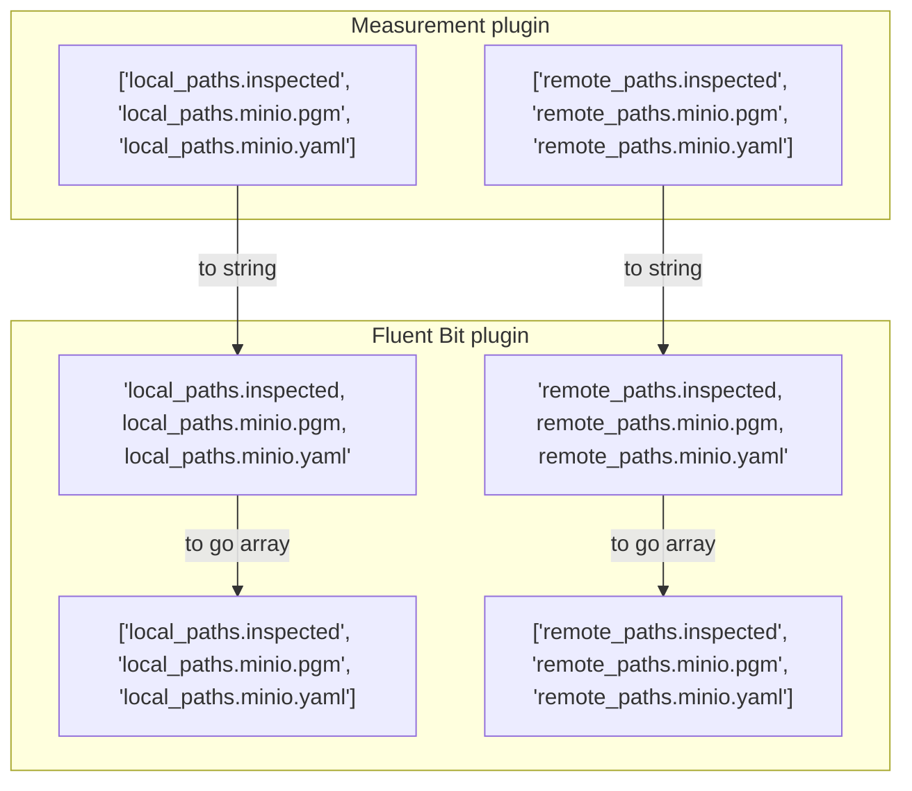

# Minio - Fluent Bit

## Description

The Minio Plugin allows to send files to Minio. It uses the GO interface provided by Fluent bit.


## Difference with Fluent bit S3 Plugin
The [S3 plugin](https://docs.fluentbit.io/manual/pipeline/outputs/s3) sends data as JSON to S3 or Minio but does not send files (e.g yaml, images etc.).

## Parameters

| Parameter             | Description                                                                        | Type        | Default                                                  |
| --------------------- | ---------------------------------------------------------------------------------- | ----------- | -------------------------------------------------------- |
| **plugin_path**       | Shared library path compiled by go                                                 | str         | "{package_share_directory}/flb_plugins/lib/out_minio.so" |
| **endpoint**          | Endpoint for the S3 API. An endpoint can contain scheme and port.                  | str         | "127.0.0.1:9000"                                         |
| **access_key_id**     | Access keys are long-term credentials for an IAM user or the AWS account root user | str         | N/A (mandatory)                                          |
| **secret_access_key** | Secret-like password to connect along he access key id                             | str         | N/A (mandatory)                                          |
| **use_ssl**           | If set to true, https is used instead of http. Default is true.                    | str         | "true"                                                   |
| **create_bucket**     | Whether the bucket will be created                                                 | str         | "true"                                                   |
| **bucket**            | Bucket name                                                                        | str         | "dc_bucket"                                              |
| **upload_fields**     | Fields containing remote paths, separated by dots                                  | list\[str\] | N/A (mandatory)                                          |
| **src_fields**        | Fields containing local paths, separated by dots                                   | list\[str\] | N/A (mandatory)                                          |

## Node configuration

```yaml
...
flb_minio:
  verbose_plugin: false
  time_format: "iso8601"
  plugin: "dc_destinations/FlbMinIO"
  inputs: ["/dc/measurement/camera", "/dc/measurement/map"]
  endpoint: 127.0.0.1:9000
  access_key_id: XEYqG4ZcPY5jiq5i
  secret_access_key: ji011KCtI82ZeQS6UwsQAg8x9VR4lSaQ
  use_ssl: false
  create_bucket: true
  bucket: "mybucket"
  src_fields:
    [
      "local_paths.inspected"
      "local_paths.minio.pgm"
      "local_paths.minio.yaml"
    ]
  upload_fields: # Remote paths created by the measurement node configuration
    [
      "remote_paths.minio.inspected",
      "remote_paths.minio.pgm"
      "remote_paths.minio.yaml"
    ]
...
```

## Parameter handling


